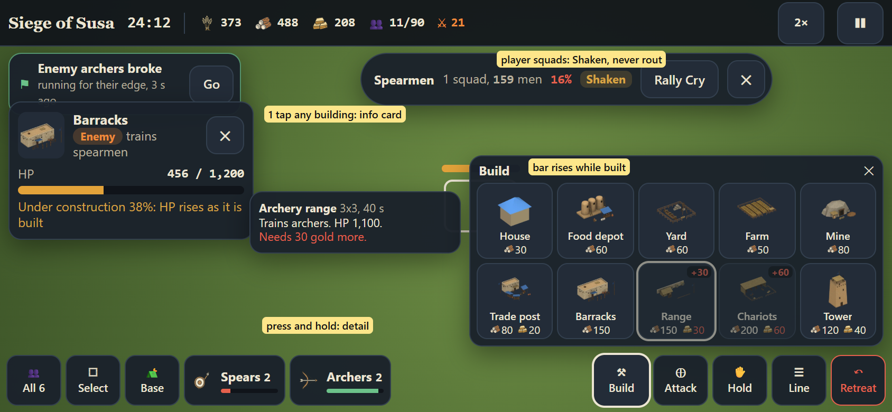

# Terra Imperium UI and UX design

Date: 2026-10-06. The screen-by-screen design for the master plan's phases (`plans/MASTER-PLAN.md`).
The live sketches are a design canvas: https://claude.ai/artifact/YLbaFgQqG1BnMUD52ZLdto (private to the
owner; share it from its Share menu). Rendered copies of every screen are in `plans/ui/sketches/`, the editable sketch sources (one
`.dc.html` per screen plus `canvas.json`) in `plans/ui/source/`, and the
written rules the sketches follow are in `plans/ui/SPEC.md` and `plans/ui/SPEC-REVISION.md`.

Every screen is drawn at 844x390, a phone held landscape (the reference screen). Desktop uses the same
layouts with more room. The sketches are suggestions: numbers on them are placeholders unless this file or
the master plan states them as rules.

## 1. Five rules

1. The map or the battle owns the screen; panels slide in from the right and close.
2. One thumb reach: the primary action bottom right, the tab rail on the right edge.
3. Markers only when they answer a question: selected, damaged, in danger.
4. Every number has a reason on tap (opinion, refusals, red settle tiles, housing, odds).
5. Command or Auto is always one tap, never buried.

## 2. The look: "Field Atlas"

| Token | Value | Use |
|---|---|---|
| ink | #10141A | ground behind the UI |
| panel | #1A212B (92% over the map) | sheets, cards |
| raised | #232C38 | selected items, raised controls |
| line | #33404F | 1 px borders |
| text / muted | #ECE5D3 / #B9B19F | body and labels |
| brass | #D8A444 | the one primary action on a screen and key numbers ONLY |
| you / enemy / independent | #5B9BF0 / #EE8A3A / #9C8FD0 dashed | team and owner colours |
| good / danger | #6CC28A / #E5604D | status |

- Type: Spectral SC for headings, Figtree for body, JetBrains Mono for numbers.
- Selection is a raised fill with a 2 px light outline (tabs: a light underline), never brass.
- The world map is the decided look: the realistic Earth raster, hexes only as a faint overlay, territories as a
  soft tint with one crisp border, fog as dark (unexplored) and grey (explored, "last seen T12").
- One identical top bar on every world screen (nation, gold, food, science and current tech, culture, year,
  turn, a war pill when at war) and one identical battle top bar (battle name, timer, food, materials, gold,
  population / cap, speed, pause).
- Ability buttons always carry a text label and cooldown.
- Touch targets 44 px for main actions.

## 3. Screens and the phases that build them

| Screen | What it proposes | Built in |
|---|---|---|
| W01 Start | world size cards, people picker with search and regions, live preview, Explored world, battle size, seed | W0 (done: StartScreen), restyle in a UI pass |
| W01 Map options | a Map row of radio cards above World size: Earth, Shuffled Earth (Climate matched / Anywhere), later Generated (preview thumbnail from the worker, shape chips, Land slider, Climate chips, New map, map code; More sheet), Region, Earth variants; "in modern X" hidden off Historical Earth; map card with Copy map code in W12 and W17 (`plans/MAP-VARIATIONS-PLAN.md` section 7) | MV1, MV5, MV7 |
| W02 Map HUD | "needs you" chips under the top bar, End Turn with a count, production bars on city banners | A2 map (done), UI pass |
| W03 Fog and contact | three fog states, ghost towns "last seen", "Unknown people", first-contact card | A (done), A2 |
| W04 Settle lens | green and red hexes with the reason on tap, Found City here / Go and found | S (done), UI pass |
| W05 City sheet | tabs, damage alert with repairs, battle housing explained line by line | B (done), UI pass |
| W06 Army move | turn badges on the route, river crossing cost, fort zone of control warning with route-around, odds with source | F (rivers), R3 (forts start battles) |
| W07 Diplomacy | met peoples, opinion reasons, "would refuse" shown before trying, unmet count | A (contact), UI pass |
| W08 Independent | personality, attitude, grudges, tribute card, mercenaries, honest action names | W1, W2 (done), W4 sheet |
| W09 Research | boost shown as part of the progress bar, map-fact boosts with a Map button, age strip, era goal | UI pass |
| W10 End turn | a call to action: it names the first thing to answer (src/engine/turnBlockers.js, "+N" for the rest) or reads End Turn; "The world moves..." progress, grouped turn report, quiet turns skip it | A (turn worker done), UI pass |
| W11 Pre-battle | scouts' range or exact odds with source, walls and houses, 300 a side and waves, Command or Auto | R2 |
| W12 Settings | globe off, battle default mode, battle size measured on this device, quality, device check | A2 (map settings done), R2 |
| W13 Peace deal | war-score demands with live accept or refuse and the shortfall, counter-offer, white peace | R2 or a diplomacy pass |
| W14 You are attacked | the interrupt: Command, Auto or Withdraw, "always Auto for defences" | R2 (Command/Auto everywhere) |
| W15 Raiders and tribute | raid party on the map, tribute demand with Pay / Refuse and the expected loss, mercenaries | W2 (done), W4 |
| W16 Battle reports | named battles list, Command/Auto tag, detail with timeline and replay | R2 |
| W17 Nation overview | ruler (no heirs), government and title, stability, era goals, victory progress, age | UI pass |
| W18 Ruler | a new rail tab after Empire: portrait, title, level and renown bar, six attributes with reasons on tap and a `+` each, the five-branch Virtue tree by age rows with one brass "Take" action, deeds, the court (advisors); W17's ruler card opens it (`plans/RULER-PLAN.md` section 6; sketch board still to add) | RU3 |
| B01 Battle HUD | clean markers, regiment cards bottom left, four commands bottom right, labelled abilities | R1 readability (done), UI pass |
| B02 Economy | worker jobs, build menu with red unaffordable costs, placement ghost with a reason | R1 (done; the ghost reason is still to do) |
| B03 Training and housing | population bar split army / workers / training, one-tap village house | R1 (done) |
| B04 Regiments | box select, general aura only when selected, formations with trade-offs, waves card. Touch box select: a visible "Select" button (one-finger drag draws the box while it is on, off after each selection; two fingers still pan), double-tap-drag kept as the shortcut, a one-time hint in the first battle | R1 / R3; the Select button as a quick fix right after the integration merge |
| B05 City assault | the real city, structure targeting, housing dropping as houses burn, the 50% bar, "spare houses" | B (done), R2 |
| B06 Alerts and pause | at most two alerts with Go, older ones as minimap pings, pause sheet with Retreat apart | R1 / R2 |
| B07 Field battle | river with fords and a bridge, enemy fort, exits "units leaving here survive", decisive reminder | F (done: river battle maps), R3 |
| B08 Result | losses, XP with its formula, general's fate, city damage under the 50% rule, loot, Auto comparison | R2 |

"UI pass" means a restyle of an existing screen to this look; schedule it after the phase that owns the
system, or as one pass once R2 lands.

## 4. One example story (all sketches use it)

The Kingdom of Akkad (capital Kish) against the Kingdom of Elam (capital Susa, fort at Der); Gutium as a
Raiders independent in the Zagros. The siege is "Siege of Susa", the field battle "Battle of Der". Susa has
24 houses holding 120 plus a town hall of 20 = battle housing 140. Odds are exact only with a spy report or
the target in full sight; otherwise the scouts' range.

## 5. Open questions

- Placeholder numbers on the sketches (build costs, loot, mercenary prices) are not rules; the RTS plan and
  balance passes set them.
- Wider sheets for Research and Pre-battle; Pre-battle and Settings hide the tab rail.
- Missing screens still to sketch: fleets and landings, tutorial for the first five minutes, desktop versions
  of the map and the battle, save and load, game over.

## 6. Phase U1 status (branch claude/phase-u1-ui-world, 2026-10-06)

One commit per step ("U1 step N"); screenshots at 844x390 and 1280x800 in `plans/ui/u1/`, taken by
`node scripts/ui/u1-shots.mjs [--only W09,W10]` against `npx vite --port 5181`.

| Step | Screen | What it is now |
|---|---|---|
| 1 | Look, W02 top bar | Field Atlas tokens, fonts and primitives (`src/components/ui/atlas.jsx`, `.fa-*` in index.css); one world top bar; End Turn bottom right; "needs you" chips; the tab rail; Settings from Menu |
| 2 | W01 Start | three columns, people picker, one brass Begin |
| 3 | W02, W03 | city banners, map controls, fog legend, "last seen", first-contact card, palette pass |
| 4 | W04 Settle lens | the site card with reasons and numbers, the lens legend |
| 5 | W05 City sheet | tabs, damage alert, battle housing line by line |
| 6 | W09 Research | wider dock; the current tech's bar with the waiting boost striped; map boosts with a Map button (switches the lens); queue chips; era goals card; focus chips; lines or web; age strip |
| 7 | W10 End turn | the three states; waits visibly for an event or a peace offer; the turn report (grouped, filter chips, a place button per line, brass Play turn N; quiet turns skip it; the turn number reopens it) |
| 8 | W12 Settings | two columns on a phone; fog shown as locked; battle size 300 a side; a performance overlay switch (the battle's fps readout, per browser); quality Auto |
| 9 | W17 Nation overview | ruler (no heirs), government and next title, stability, legitimacy, authority with reasons, victory progress and score rank, era goals with the way forward, age strip with the next age's turns |
| 10 | W07 Diplomacy | Peoples in a wide dock: list with relation word and opinion bar, the chosen people's card with tiles that say "would accept / would refuse" before trying and the first refusal's reason; answers waiting on top |
| 11 | W08 Independent | the W4 sheet restyled to the tokens; brass only on the primary action; the independents list in Peoples |

Left for other branches or phases: W06 and B07 (need R3), the war screens W11, W13 to W16 and the
battle screens B01 to B08 (another branch).

Gaps found (no engine data or no system yet; the screens show what exists):
- W10: the turn worker reports no progress, so "The world moves" has no step count (the sketch's 23 / 36).
- W12: the 500 and 1,000 battle sizes and the device check that measures them, a quality choice
  (the battle has one adaptive profile), a world-map performance overlay and a language choice.
- W17: no heirs by design (decision 37); the ruler's reign end is not shown (`reignEndsTurn` is an
  internal roll). Legitimacy has no reason list in the engine (authority's parts are shown instead).
- W07: the opinion threshold for an alliance is a score (`allianceAcceptanceScore`), not an opinion
  number, so the refusal line names what moves it rather than a single target.
- W08: one mercenary offer at a time (the engine offers the best band in reach), not a list.

## 7. Phase U1b status: the war screens (branch claude/phase-u1b-ui-war)

Screenshots at 844x390 and 1280x800 in `plans/ui/u1b/` (`node scripts/ui/u1b-shots.mjs`, `node
scripts/ui/u1b-battle-shots.mjs` with a dev server). Shared pieces: `src/components/battle/warModel.js`
(men and lines, where odds come from, the scouts' range, 300 a side and waves, walls, houses and the 50%
rule) and `warAtlas.jsx` (force cards, Command / Auto / Withdraw cards, the explain box, the odds bar).

- W14 You are attacked: done (DefenseSheet.jsx, defenseSheetModel.js). Gap: no "your nearest army, N turns
  away" line (needs a relief estimate); Withdraw is offered for cities only, as the engine allows.
- W11 Pre-battle: done (PreBattleModal.jsx, preBattleModel.js). Gaps: "300 a side and waves" counts
  regiments against the ground's front width (combatWidth): the regiment-to-representatives mapping (RTS
  plan 5.1) is not in the sim yet; the 500 / 1,000 presets wait for W12 and R3; the fog keeps no "last
  seen T27" turn for a garrison; the scouts' range is the real strength plus or minus a fifth (UI only).
- W16 Battle reports: done (BattleReportSheet.jsx, battleReportsModel.js). Gaps: reports keep no event
  timeline ("5:30 East wall breached"), no city damage, XP or general's fate; commanded battles keep no
  replay; raids are not reported until R3 swaps raidBattle.js.
- W13 Peace deal: done (PeaceDealSheet.jsx, peaceDealModel.js; PeaceOfferSheet.jsx restyled). Notes: "the
  most they give" is the engine's own ledger filled cheapest first (the AI makes no counter-offer of its
  own); the ledger's "War situation" reads the war score stored each turn, so it can lag the live parts
  shown on the left until the turn ends.
- W15 Raiders and tribute: done (TributeDemandSheet.jsx on the right so the raid stays in view; raid chips
  on the flat map restyled). The WebGL map's raid marks belong to the world map (U1 step 3).
- B01 Battle HUD: done (BattleHud.jsx, battleHudModel.js): one battle top bar, regiment cards, labelled
  commands and ability cards. Gaps: regiment cards group by kind (the sim has no regiment names such as
  "Kish Spears"); no minimap; Stop moved to the long-press ring.
- B05 City assault: done (housing as houses burn, the 50% line, gate, towers and keep, the target of the
  selection). Gap: "Spare houses" needs a sim order (no rule exists).
- B06 Alerts and pause: done (two alerts with Go, older ones folded into a count; the pause sheet with
  Resume, speed, time left, Switch to Auto and Retreat apart, sound, powers; "Give orders" sets it aside).
  Gaps: alerts are read from frame differences in the UI (no sim event stream); older ones cannot ping a
  minimap that does not exist.
- B08 Result: done (BattleResultScreen.jsx; autoCompare.js): losses, XP by the outcome service's formula,
  the general's fate by the same roll as aftermath.js, the city under the 50% rule, loot, Auto's odds for
  the same battle. Gaps: the war score change is only known after Continue (the outcome service applies
  it); loot is the battle economy's gold only.
- W06 Army move and B07 Field battle: not done, they need phase R3.

## 8. B09 Battle UX pass (branch claude/battle-ux, 2026-10-07)

Sketch: `plans/ui/battle-ux/mockup.html` (rendered `mockup-844x390.png`); before and after screenshots
at 844x390 and 1280x800 in `plans/ui/battle-ux/before/` and `after/`.

- **Inspect anything.** One tap (left click) on any building or structure selects it: your own
  economy buildings, the enemy's, the camp, the keep / town hall, towers, wall segments, the gate,
  houses, the region's buildings, and resource nodes. A card top left (under the alerts) shows a picture
  (the building's rendered icon), the name, an owner chip (You / Enemy / Neutral), HP current / max
  with a bar, and one state line (under construction N%, ruined, garrison n / m, "trains spearmen",
  "+10 housing", "drop-off for food"). A node shows what is left. Your own producers keep their
  actions (train, queue, rally) below the same header. On the field the selected building shows its
  health bar even at full HP, plus the selection ring; damaged buildings keep their bars as before.
- **Construction HP (AoE style).** A site starts at 1 HP and its HP rises with the work, to full when
  it is done (the sim already did this: economy.js updateEconomy). The field bar and the card show HP,
  not the build percentage, so a site hit while it goes up shows the damage; the card adds "built N%".
- **Build menu with pictures.** A grid of tiles (6 across, 64 px tall on a phone, 72 on a desktop): the building's
  picture (`src/assets/icons/battle/build-*.webp`, rendered from the battle's own models by
  `scripts/art/build-icons.mjs`), a short name, the cost with resource icons (wheat, timber, gold);
  a cost you cannot pay is red and the tile carries the shortfall ("+30"). Press and hold (hover with a
  mouse) opens the detail: what it does, HP, footprint, build time, and why it is disabled. A tap on a
  disabled tile shows that detail instead of doing nothing.
- **Phone bars (844x390).** Top bar: resource icons instead of FOOD / MAT / GOLD words, people and
  swords icons for population and the enemy; speed and pause 44 px. Bottom: 52x48 command tiles with
  an icon and one short word (Build, Attack, Hold, Line, Retreat); regiment cards with the class icon,
  a short name, the count and the health bar.
- **Alerts never cover the selection.** Alerts, the selection pill and the city card share one top row
  (alerts left, selection in the middle, city right), so they cannot overlap. An alert's Go centres the
  camera and selects the squad when it is yours.
- **Morale for the player is soft (user decision 2026-10-07).** In a commanded battle the player's
  squads never rout: at low morale they are **Shaken** (weaker blows, more hurt taken) and the regiment
  card and selection pill say so; Rally Cry restores them. The AI side still routs and runs for its
  edge; auto-resolve keeps routing for both sides. A per-side flag in the setup (`sides[s].canRout`,
  set from `setup.controllers` when a commanded battle opens). No "your squad routed" alert; "enemy
  squad broke" stays.

Status (done on claude/battle-ux): the info card for anything on the field (`inspectModel.js`,
`EconomyHud.jsx` InfoCard, BattleRenderer `setInspected`: the bar even at full HP and a ring); site bars
show HP (`economyLayer.js` bars); the build menu with the rendered pictures, shortfall badges and the
press-and-hold / hover detail; the phone bars and the one top row (`BattleHud.jsx`); Shaken, Rally Cry
on the selection pill and the shaken alert, Go selecting the squad. Shaken is x0.6 damage dealt and
x1.3 taken (sim/morale.js), chosen with battle-lab parity: in the campaign field mirror (bronze,
16 seeds) a no-rout attacker wins 7 of 16 against Auto's 6 (10 with a softer x0.75 / x1.15), exchange
1.18 against Auto's 1.02 and 1.26 when everyone routs. Screens: `plans/ui/battle-ux/after/`
(`node scripts/ui/battle-ux-shots.mjs`, `node .claude/skills/battle-lab/eco-shot.mjs`); the
pictures again after new building art: `node scripts/art/build-icons.mjs`.
Gaps: city wall segments and the gate have no rendered picture (a glyph); the region's buildings use
the map's building icons; enemy squads still show "routed" when they break (their rule is unchanged).
