# Wonders and base landmarks in the close view

Branch `art/wonders-buildings`. Every wonder of the game now stands on its tile as a 3D model, and
every city outside Israel shows its buildings as base-style landmarks round its town.

Inputs (unzipped into a scratch directory, never committed):
- `plans/art/downloads/blender-remaining/checkpoint-12` parts 1 to 3: the 15 wonders
  (`great_pyramids` ... `atomic_research_center`); part 4: granary, irrigation, farm_estate,
  crop_rotation_farm, mechanized_farm.
- `checkpoint-13` parts 1 to 4: the other 20 landmarks (market ... shipyard).
- `checkpoint-02` part 4: `solomons_temple` and `masada` (replacing the older files in the repo).

## How the files were made

The deliveries hold one mesh per object (`tier1`..`tier3` or `landmark`), PNG textures, no LODs.
Each went through the repo's importer under Blender 5.2 (the `bpy` wheel, headless):

```
python scripts/blender/import_model.py <model.glb> src/assets/map/wonders/<id>.glb tier1,tier2,tier3 wonder
python scripts/blender/import_model.py <model.glb> src/assets/map/buildings/<id>.glb <id> landmark
python3 scripts/blender/validate_model.py <out.glb> <dir> wonder|landmark
npm run pack:models
```

No scale was applied (scale 1.0 on every file): the deliveries are already 1 unit = 10 m, and the
importer only centres the joint footprint of the three tiers (they keep one origin). Roots are named
after the bare id (`bank`, the format `buildingRoot` reads) or `tier1`..`tier3` with LOD0..LOD2
children. Materials stay `Town` and `Team`; textures are written as WebP.

**Shading, darkened once.** AO comes in the file as vertex colour `COLOR_0` (the corrected workflow
of quality-revision-01) and the base colour texture is not darkened. The importer keeps COLOR_0
(checked on every output) and leaves the material factors alone. In the game GLTFLoader turns on
`vertexColors` for it, and neither buildingLayer.js (it shares the file's material) nor
`instanceTownAsset` (wonders) adds any darkening, so AO is applied exactly once. The screenshots show
the models as light as the towns beside them.

**Ground discs.** The checkpoint-02 Masada and Solomon's Temple have no ground disc (no faces at
ground level at all: Masada stands on its rock, the temple on its platform), so the dark disc of
the old files is gone. Of the other files only real paving lies at ground level, in `Town`: the
Colosseum's light stone apron, the cathedral's nave floor, courtyards and forecourts. None is a
plate under the model, so no `Ground` material was needed.

## Ids

- Wonders: the 17 files match the 17 ids of `GREAT_PROJECTS` exactly (src/data/greatProjects.js).
  No delivered wonder lacks a game id and no game wonder lacks a model. A test now checks both ways.
- Landmarks: all 25 ids were already in `BUILDING_MODEL_IDS`. Building tiers still without a base
  model: `cathedral` (culture tier 3), `naval_base`, `carrier_dock`, `road_post`, `highway`,
  `rail_depot`, and the extraction landmarks `copper_mine` (Israelite file only), `iron_foundry`,
  `oil_well`. A city with those draws its other landmarks.

## Harbor and shipyard on the shore

Before this branch a landmark took the first free land spot, so a harbor could stand inland. Now
(buildingModels.js `needsCoast`, `facingOut`, shore spots; CloseViewLayer.jsx `accept`) a naval
landmark (harbor, shipyard, and naval_base and carrier_dock when they arrive) takes only a spot on
the edge of the town's ground or outside its wall, turned so its front (the quay, +z in the file)
faces away from the town, and only where the map has land under it and behind it and water in front
of the quay. A town with no such spot shows no harbor. The Israelite harbor follows the same rule.
In the Alexandria shot the harbor stands on the north shore of the town, its boats on the sea.

## Sizes

The landmarks are 10 to 19 m across (the Israelite ones are 15 to 18 m), so they take the
existing 0.8-unit disc. Wonders are 34 to 112 m across (Masada and the Forbidden City the largest)
and up to 162 m tall (the Space Program's rocket gantry); they use the towns' pixels per unit and
are capped to their own tile (the rule the Israelite wonders branch set), so they stand beside
the town at their real size relative to it and never spill into the next tile.

Draw calls: the landmarks keep the instanced path of buildingLayer.js (one InstancedMesh per model
file, LOD and material). Wonders are one per tile and stay clones (instanceTownAsset).

## Files

| Wonder | LOD0/LOD1/LOD2 triangles, tier 1 · 2 · 3 | Tier 3 size (w x d x h) | Unpacked | Packed | validate_model |
|---|---|---|---|---|---|
| arsenal | 5857/5857/1455 · 12224/9700/1455 · 15615/9700/1455 | 67 x 64 x 14 m | 6.2 MB | 1.1 MB | pass |
| atomic_research_center | 6256/6256/1455 · 8605/8605/1455 · 14619/9700/1455 | 94 x 82 x 31 m | 5.6 MB | 0.9 MB | pass |
| colosseum | 14479/9700/1455 · 45887/9700/1455 · 52665/9700/1455 | 100 x 76 x 50 m | 12.4 MB | 2.5 MB | pass except file_size |
| forbidden_city | 15982/9700/1455 · 27160/9700/1455 · 58478/9700/1455 | 80 x 92 x 18 m | 11.0 MB | 2.1 MB | pass except file_size |
| grand_bazaar | 10250/9700/1455 · 25501/9700/1455 · 44841/9700/1455 | 73 x 68 x 15 m | 9.5 MB | 2.0 MB | pass except file_size |
| great_cathedral | 31059/9700/1455 · 38478/9700/1455 · 56747/9700/1455 | 51 x 76 x 110 m | 13.2 MB | 2.6 MB | pass except file_size |
| great_library | 4740/4740/1455 · 10269/9700/1454 · 18041/9700/1455 | 68 x 66 x 20 m | 6.1 MB | 1.2 MB | pass |
| great_pyramids | 2074/2074/1455 · 2837/2837/1455 · 5252/5252/1455 | 82 x 75 x 26 m | 2.5 MB | 0.4 MB | pass |
| great_wall | 1370/1370/1370 · 3378/3378/1455 · 6811/6811/1455 | 104 x 37 x 28 m | 2.8 MB | 0.5 MB | pass |
| hanging_gardens | 15222/9700/1455 · 25481/9700/1455 · 34058/9700/1455 | 66 x 56 x 37 m | 9.0 MB | 1.9 MB | pass except file_size |
| international_exchange | 4900/4900/1455 · 13232/9700/1455 · 22678/9700/1455 | 44 x 40 x 95 m | 5.4 MB | 1.2 MB | pass |
| lighthouse | 9752/9752/1455 · 13732/9700/1455 · 17874/9700/1455 | 34 x 69 x 108 m | 6.0 MB | 1.3 MB | pass |
| masada | 10579/9700/1455 · 17651/9700/1455 · 24699/9700/1455 | 85 x 112 x 39 m | 7.1 MB | 1.7 MB | pass except file_size |
| palace_of_versailles | 15006/9700/1455 · 41902/9700/1454 · 50432/9700/1455 | 75 x 81 x 17 m | 11.6 MB | 2.2 MB | pass except file_size |
| royal_observatory | 3122/3122/1455 · 7264/7264/1455 · 13025/9700/1455 | 47 x 61 x 25 m | 4.7 MB | 0.8 MB | pass |
| solomons_temple | 3002/3002/1455 · 22156/9700/1455 · 37724/9700/1455 | 85 x 91 x 18 m | 7.7 MB | 1.4 MB | pass except file_size |
| space_program | 12250/9700/1455 · 26400/9700/1455 · 36576/9699/1455 | 66 x 51 x 162 m | 8.7 MB | 1.6 MB | pass except file_size |

| Landmark | LOD0/LOD1/LOD2 triangles | Size (w x d x h) | Packed | validate_model |
|---|---|---|---|---|
| bank | 4184/2910/485 | 16 x 13 x 11 m | 0.29 MB | pass |
| barracks | 8060/2910/485 | 17 x 12 x 5 m | 0.39 MB | pass |
| bazaar | 5170/2910/485 | 16 x 13 x 8 m | 0.31 MB | pass |
| civic_center | 3524/2910/484 | 15 x 13 x 6 m | 0.24 MB | pass |
| crop_rotation_farm | 4490/2910/485 | 17 x 13 x 8 m | 0.32 MB | pass |
| drill_yard | 6115/2910/485 | 17 x 12 x 7 m | 0.29 MB | pass |
| factory | 3156/2910/485 | 16 x 12 x 14 m | 0.21 MB | pass |
| farm_estate | 3297/2910/485 | 19 x 13 x 8 m | 0.28 MB | pass |
| granary | 2900/2900/485 | 13 x 8 x 7 m | 0.16 MB | pass |
| harbor | 4043/2910/485 | 16 x 12 x 6 m | 0.29 MB | pass |
| irrigation | 3053/2910/484 | 14 x 11 x 6 m | 0.28 MB | pass |
| library | 8653/2910/485 | 16 x 9 x 13 m | 0.40 MB | pass |
| manufactory | 6770/2910/485 | 16 x 11 x 15 m | 0.30 MB | pass |
| market | 3695/2910/485 | 17 x 11 x 6 m | 0.28 MB | pass |
| mechanized_farm | 8537/2910/485 | 18 x 12 x 9 m | 0.37 MB | pass |
| military_academy | 11932/2910/485 | 17 x 14 x 8 m | 0.43 MB | pass |
| research_lab | 3536/2910/484 | 15 x 10 x 8 m | 0.24 MB | pass |
| scriptorium | 6285/2910/485 | 17 x 13 x 6 m | 0.32 MB | pass |
| shipyard | 3906/2910/485 | 14 x 17 x 6 m | 0.27 MB | pass |
| shrine | 940/940/485 | 10 x 10 x 6 m | 0.19 MB | pass |
| stock_exchange | 6540/2910/484 | 18 x 15 x 26 m | 0.32 MB | pass |
| temple | 4187/2910/485 | 11 x 17 x 9 m | 0.29 MB | pass |
| university | 8352/2910/485 | 16 x 15 x 9 m | 0.34 MB | pass |
| war_college | 7272/2910/485 | 17 x 13 x 14 m | 0.33 MB | pass |
| workshop | 4285/2910/485 | 14 x 11 x 7 m | 0.29 MB | pass |

The nine wonders marked file_size exceed the importer's 6 MB pre-pack limit only on raw float
geometry (30k to 58k triangles in tier 3, vertex colours already packed to 8 bits); packed they are
1.4 to 2.6 MB. Every other check passes on every file (`validation/`).

Size added to the repo: buildings 1.0 MB -> 8.4 MB, wonders 0.9 MB -> 25.5 MB, so about 32 MB.
A wonder file loads only when that wonder is built and on screen.

## Browser check

`npx vite`, then `node plans/art-pilot/wonders-buildings/browser-check.mjs <out> both` (Chromium from
/opt/pw-browsers, software GL). It starts as Egypt, founds Rome and Alexandria on their own tiles,
gives Cairo, Rome, Alexandria, Beijing and London buildings and tier 3 wonders through the dev
modules, saves, reloads and shoots k 60 and 120 on desktop (1440x900, map area cropped) and on
the 844x390 phone. London is shot in a second save with the calendar in the Modern age (`AGE=modern`;
a nation's own tech age can lead the calendar by one age only). No page errors or console warnings
in any run.

| | |
|---|---|
| 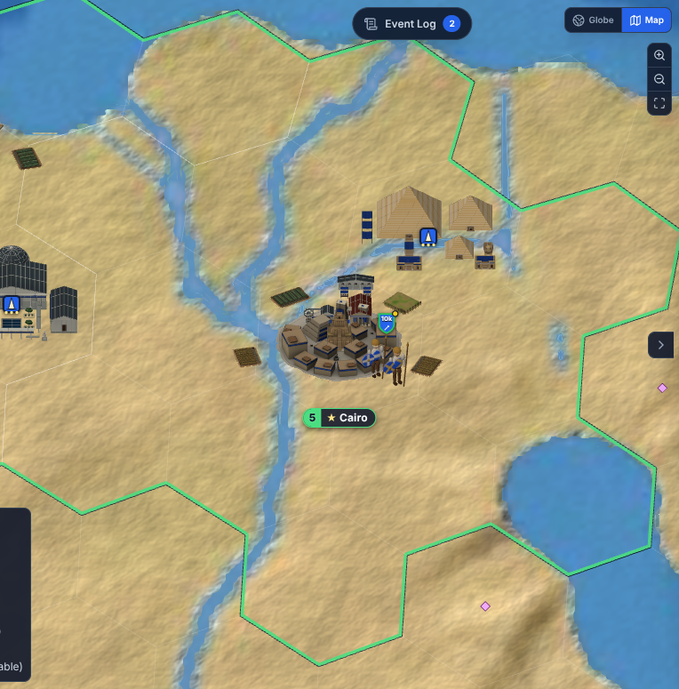 Cairo, the pyramids north-east; Alexandria's lighthouse and library top left | 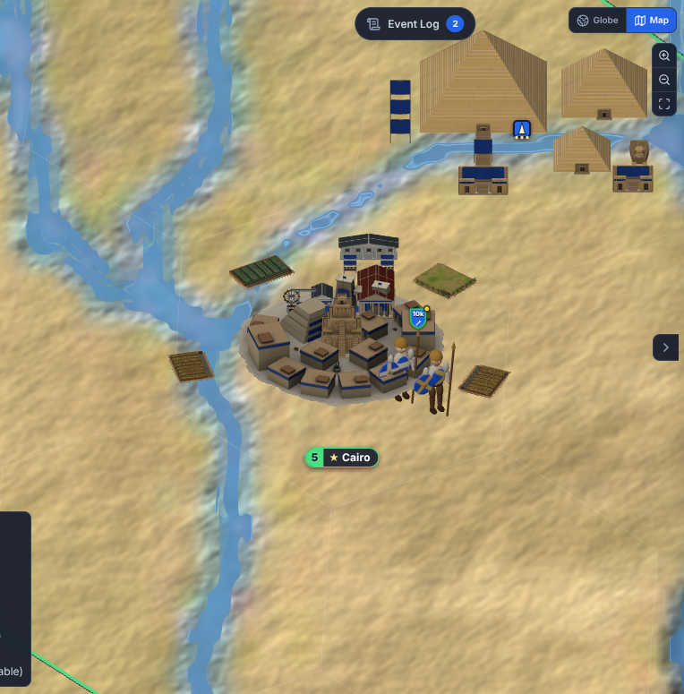 Cairo k120, given a temple, irrigation and a market |
| 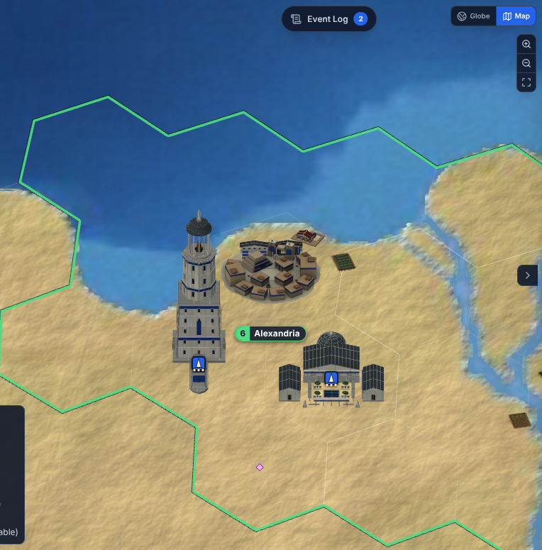 Alexandria, the lighthouse and the library | 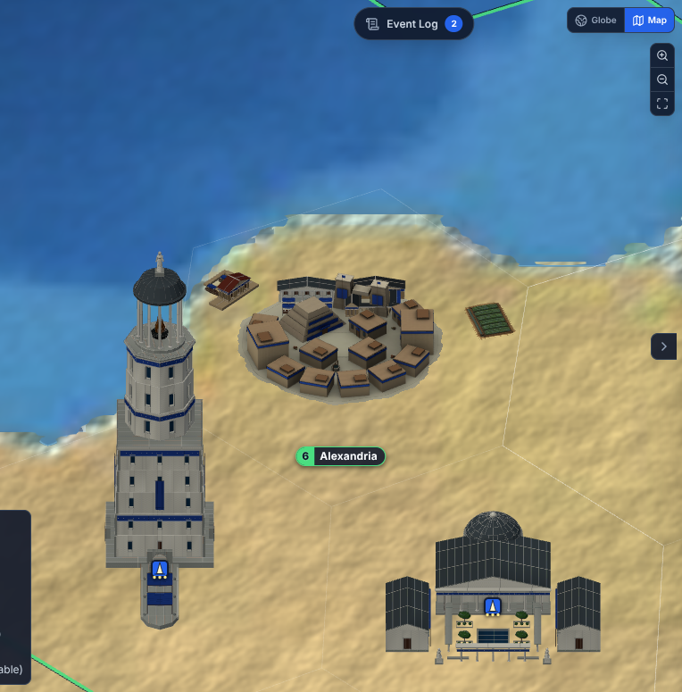 Alexandria k120: the harbor on the shore (top left of the town), the scriptorium and the market on the back rim |
| 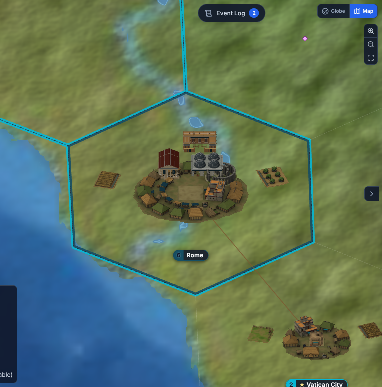 Rome: temple, bazaar and barracks | 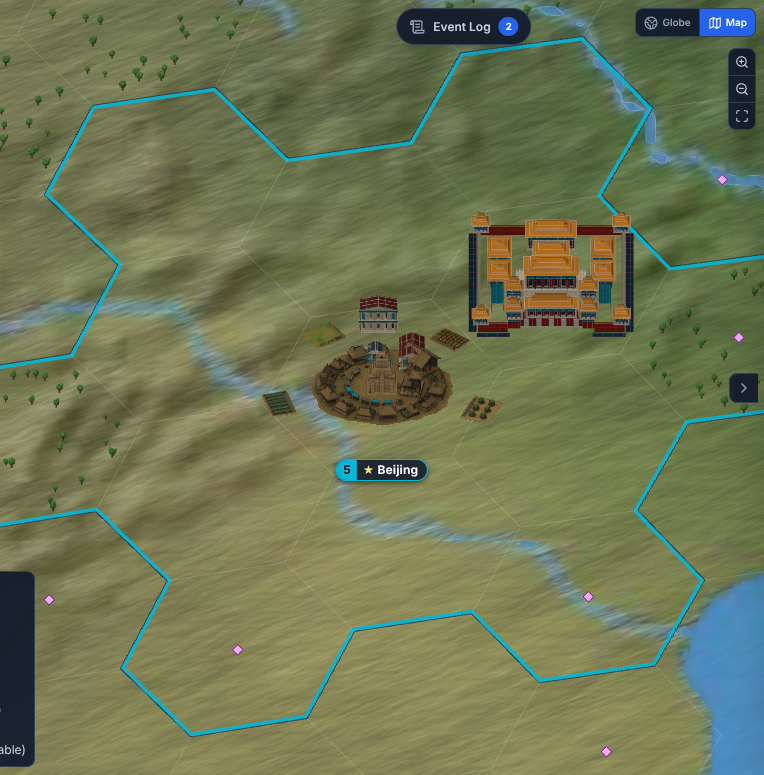 Beijing and the Forbidden City |
| 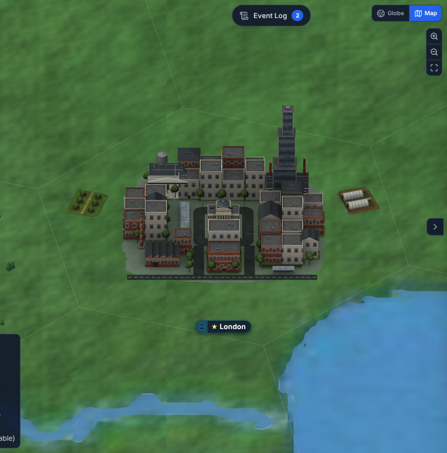 Modern London: the bank (white portico, back left) and the factory (red chimneys, right) | 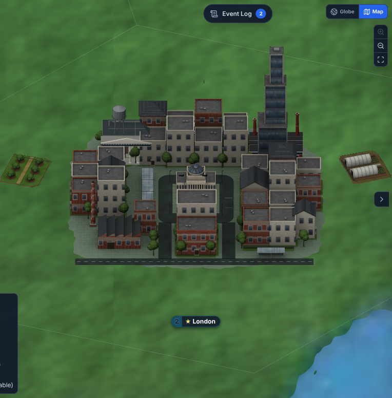 the same at k200 |
| 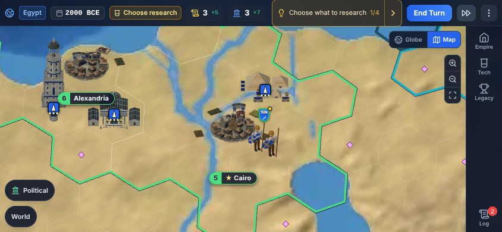 phone, Cairo and Alexandria | 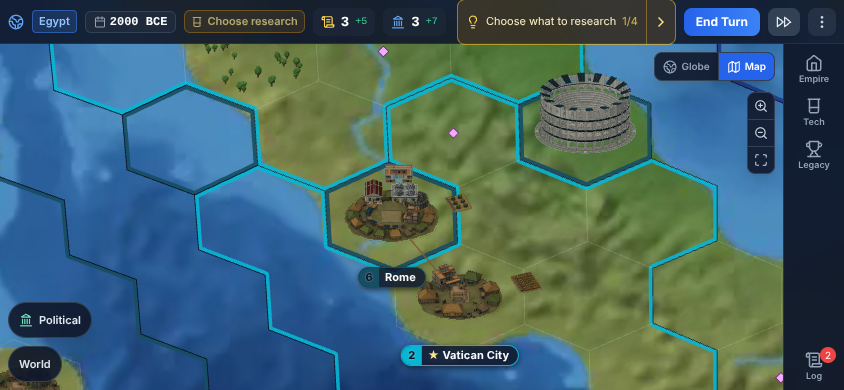 phone, Rome and the Colosseum |
| 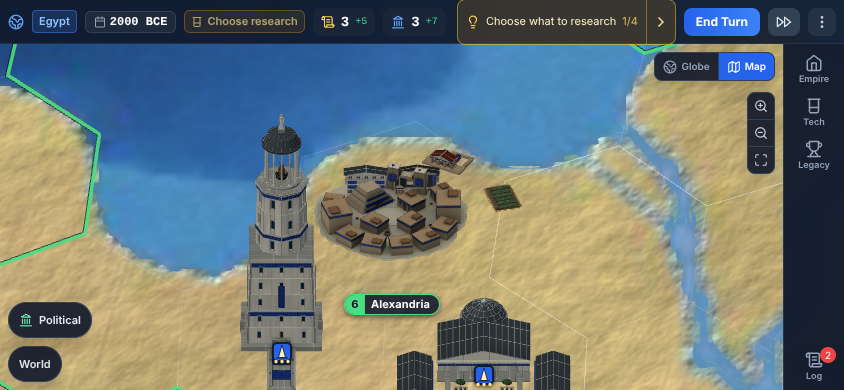 phone, Alexandria k120 | 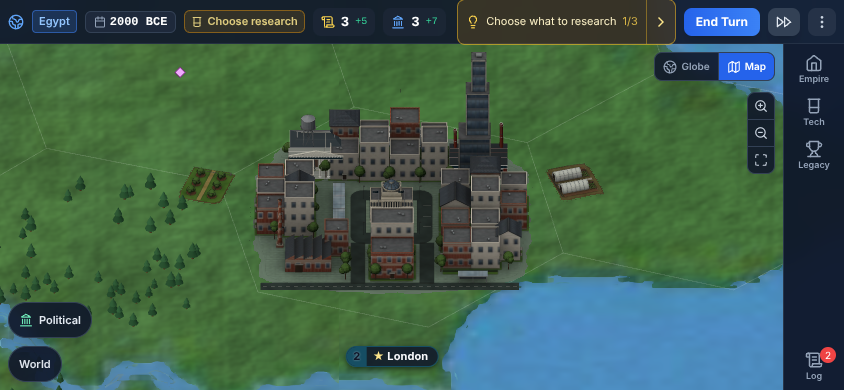 phone, Modern London k120 |

Notes from the check:
- The landmarks read as light as the towns (no double AO). The Great Library's slate roofs and
  dark windows make it the darkest wonder, by design of the model.
- In a Modern big town the 16 m landmarks are small next to the town's tall blocks; they are at
  their real size and still read (portico, chimneys).
- On the phone the research sheet stays open in some shots (it covers the right third of the
  map); the script's close tap did not always land. Not a model issue.
