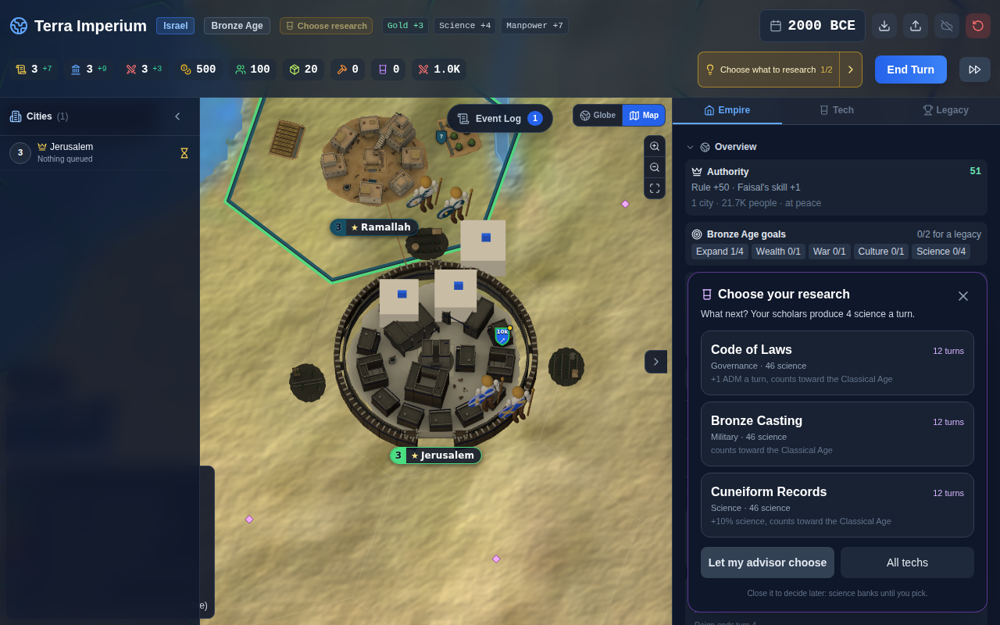
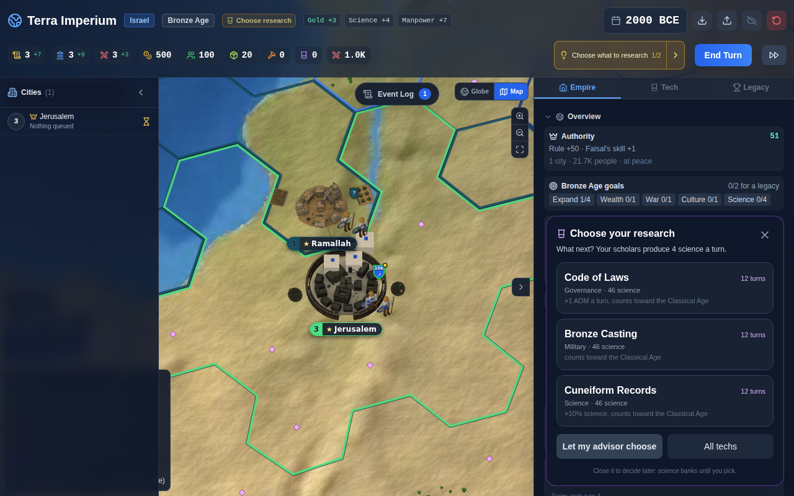
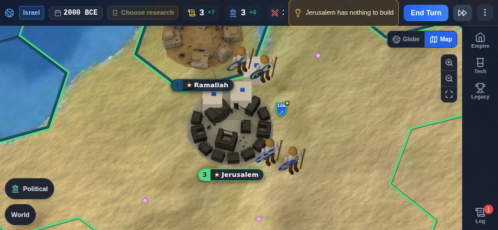

# Building landmarks in the close view

Branch `game/building-models`. A city's constructed buildings now stand round its town in the close
view as their landmark models (art spec section 4, Israelite theme section 4).

## What the player sees

When an artist town is on screen, its highest building tiers that have a model file stand on free
ground round it: first near the town's rim on the back (north) side, away from its banner below the
town, then just outside the wall ring between its fields. They take the town's scale (the hex and
room capped one), tilt, level of detail and Team colour, and never stand on water or on anything
else (other towns, works, fields, other landmarks). No file means nothing is drawn and the town
stays exactly as before. Today no building file is in the repo, so the game looks unchanged until
the art session's `*-israelite.glb` files land.

The boxes with a blue flag are placeholder GLBs from the test fixture (`glbFixture.js`), written
locally for the screenshot only and not committed: the real Israelite models were not on
`origin/art/maghreb-westafrica` yet. Two stand on the back rim of the town, one outside the wall
to the north; the fields keep their places east and west.

| Desktop, k 60 | Phone landscape 844x390, k 120 |
|---|---|
|  |  |

On the phone Jerusalem is squeezed by Ramallah next door (`townGapUnits`), so the spot outside its
wall is taken by Ramallah's ground and only the rim spots are used.

## Files

- `src/components/map/closeView/buildingModels.js` (pure, unit tested)
  - `BUILDING_MODEL_IDS`, `EXTRACTION_MODEL_IDS`: tier to model id (`granary`, `irrigation`, ...;
    defense has none, its tiers are the wall rings).
  - Files: `src/assets/map/buildings/<id>.glb` and `<id>-<style>.glb`, read with
    `import.meta.glob`. `buildingModelUrl(id, style)` walks `styleChain(style)` (israelite, levant)
    and then the base file.
  - `pickBuildingModels(region, style, tierId)`: highest rank first (the tier's age, then the tier,
    then culture, science, economy, military, food, industry, naval, logistics), only buildings
    with a file, at most 3 for a small or medium town and 4 for a big one. Cached per buildings,
    style and size.
  - `buildingSpots(tierId, seed, fields)`: candidate spots in the town's model space. Inner rim
    spots (1, 2 or 3 by size) on the north side, clear of the palace; outer spots every 20 degrees
    just outside the wall ring's outer edge, never in front of the gate or where the army stands,
    clear of the town's own fields; north first. Cached on the town mesh.
  - `assignSpots(models, spots, accept)`: greedy, each landmark the first spot that does not
    overlap one already placed and that the map accepts.
- `src/components/map/closeView/buildingLayer.js`: instanced drawing. One `InstancedMesh` per model
  file, LOD and material, shared by every town; a mesh with several materials is split into parts
  that share its buffers. Team takes the town colour and Ground the town's ground tint through the
  instance colour (Team x1.3, as `instanceTownAsset`).
- `CloseViewLayer.jsx`: after every town has claimed its ground, each town's landmarks are
  assigned: a spot must be land at its centre and four rim points (`landAt`), and an outer spot
  must also win its disc in the occupancy (so works, fields and trees then avoid it). Inner spots
  only compete with the town's other landmarks.
- `glbFixture.js`: writes a tiny GLB in the map format (root named after the id, LOD0..LOD2, Town
  and Team materials). Used by the tests and for local browser checks.

## Performance

Draw calls grow with the kinds of landmark on screen, not with the towns: a model with Town and
Team parts costs 2 draw calls whatever the number of towns showing it. The check above measured 6
extra draw calls for three different models. Per frame the work is a few `landAt` lookups and
matrix products per town with landmarks; the picks and spots are cached.

## Checks

- `buildingModels.test.js`: ids match every building tier; style chain and base fallback; ranking;
  the cap; zero files draw nothing; inner spots on the back rim inside the ground and clear of the
  palace; outer spots outside the wall, never at the gate, clear of fields; greedy assignment; and a
  generated GLB parsed by GLTFLoader through `loadAssetObjects` into the instanced layer (40 towns,
  2 draw calls, Team tinted per town).
- Browser: Playwright with `/opt/pw-browsers/chromium`, `npx vite`, Israel's capital given seven
  buildings through `window.__game`, `window.__map2DTest.focus` at k 16 to 120, desktop and phone.
  No page errors; the only console notices were the software GL driver's ReadPixels stalls.

## Open

- Recheck with the real Israelite models once `origin/art/maghreb-westafrica` has
  `src/assets/map/buildings/*-israelite.glb`: copy them in locally, run the same check, look at
  scale (the code assumes the files use the town files' units, 1 unit = 10 m).
- The naval line could prefer a spot on the coast side; today it takes the first free land spot.
- `cathedral-a` / `cathedral-b` (spec section 4) would read as style `a` / `b`: if both are
  delivered, name them `cathedral.glb` and `cathedral-<style>.glb` or add a variant rule.
