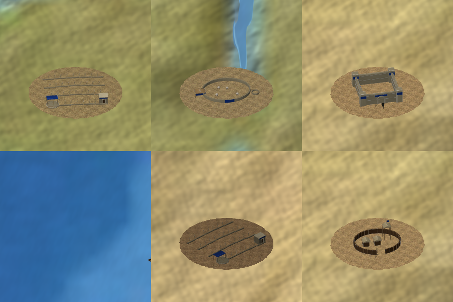
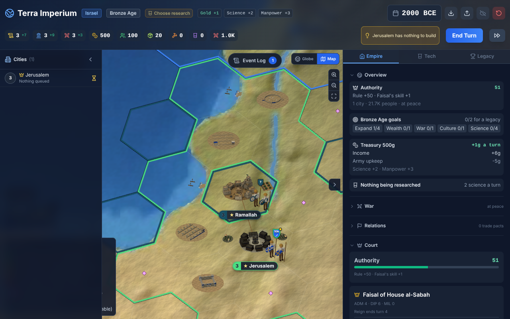
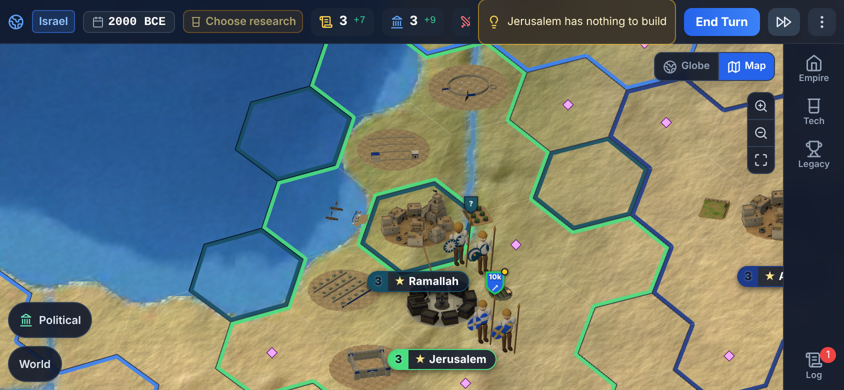
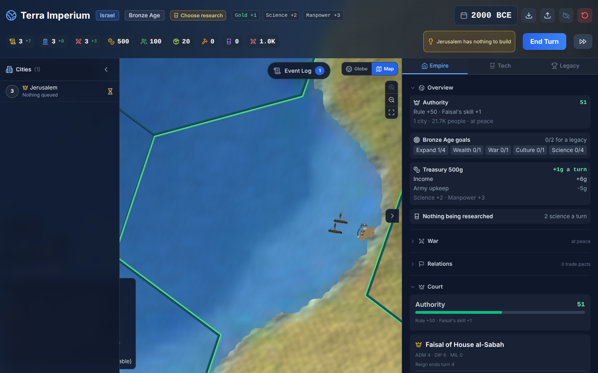
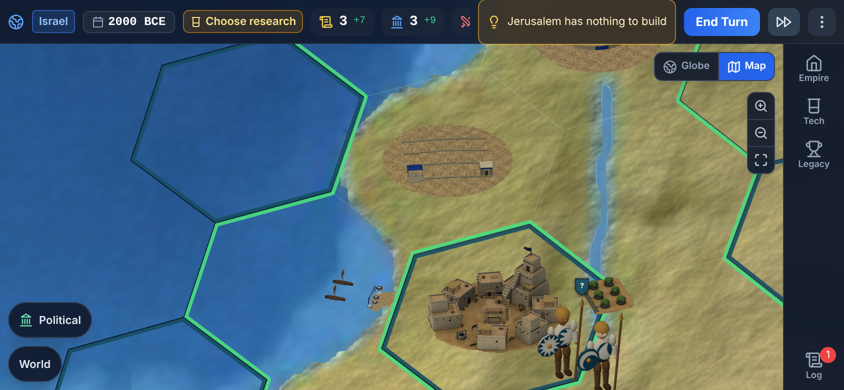

# Tile improvement models in the close view

Branch `game/improvement-models`. An improved tile now shows its improvement's artist model in the
close view when a file exists for the improvement, the owner's age and the land's style; otherwise
the procedural work (or the town fields standing in for farms, pastures and plantations) stays.
The first files are the six Israelite improvements (art spec section 6, Israelite theme section 6;
checkpoint-04 and quality-revision-01 for the fishing boats).

## What the player sees



Top row: the highland farm (terraced strips, threshing floor, watch hut), the stone sheepfold
beside the Jordan, the bronze-age casemate fort. Bottom row: the Ginosar boats on the coast, a
pillaged farm (drawn darker), and the modern tower and stockade post (the same tile in the Modern
Age).

| Desktop, k 60 near Jerusalem | Phone 844x390, k 60 |
|---|---|
|  |  |

| Fishing boats on the coast, desktop k 200 | Phone 844x390, k 120 |
|---|---|
|  |  |

The test tiles (Israel's land on the frequency-100 grid): farm 82396 (the coastal plain), pasture
82319 (Galilee, beside the lake and the Jordan), plantation 82473, fort 82474, pillaged farm 82475,
fishing boats on the sea tiles 82472 and 82395. Jerusalem's own tile (82398) and Ramallah's
(82397, land of `ps`, so the Levant style) hold cities.

## Files and naming

`src/assets/map/improvements/<kind>[-<age>][-<style>].glb`

- `kind`: the improvement id of `src/data/tileYields.js` (`farm`, `fishing_boats`, `fort`, ...).
- `age`: the first game age the model stands in (`bronze`, `classical`, `kingdoms`, `gunpowder`,
  `modern`); left out it means `bronze`. The spec's "ancient" sheets are `bronze`, its "modern"
  sheets `modern`, the forts `fort-<age>`.
- `style`: an architecture style of `src/data/architecture.js`; left out, the base set every land
  falls back to.

Examples: `farm-bronze.glb`, `farm-modern.glb` (a base set); `farm-bronze-israelite.glb`,
`fort-modern-israelite.glb` (a region's). Each file holds one root named after the file with LOD0,
LOD1, LOD2 and the materials Town, Team, Ground.

Lookup (`improvementModel(kind, ageId, style)` in `improvementModels.js`): the latest age at or
below the owner's age that has any file for the kind wins; within that age the land's style chain
(`israelite`, `levant`) comes first, then the base file. A later base model beats an earlier
regional one, as towns pick their age's model before their style. The owner's age is the
`ageOf` of the close view (calendar or tech age); the style is `styleOfLand(countryOf(tile) ||
owner, age)`, so a sea tile takes the owner's style.

Delivered here:

| File | From | LOD0 / LOD1 / LOD2 triangles |
|---|---|---|
| farm-bronze-israelite.glb | improvements/ancient/farm-israelite | 7,330 / 1,456 / 290 |
| plantation-bronze-israelite.glb | improvements/ancient/plantation-israelite | 7,483 / 1,456 / 290 |
| pasture-bronze-israelite.glb | improvements/ancient/pasture-israelite | 3,171 / 1,455 / 290 |
| fishing_boats-bronze-israelite.glb | quality-revision-01 fishing_boats-israelite | 2,024 / 1,457 / 291 |
| fort-bronze-israelite.glb | improvements/bronze/fort-bronze-israelite | 1,245 / 1,011 / 290 |
| fort-modern-israelite.glb | improvements/modern/fort-modern-israelite | 2,630 / 1,454 / 290 |

So an Israelite fort is the casemate fort from the Bronze to the Gunpowder Age and the tower and
stockade in the Modern Age; the ancient farm, pasture, plantation and boats stay through every age
until a later file arrives.

### Converting a delivery

```
python scripts/blender/import_improvement.py <model.glb> src/assets/map/improvements/<file>.glb <file>
python scripts/blender/validate_model.py <that file> plans/game/improvement-models/validation improvement <footprint> <height>
npm run pack:models
```

(Blender's Python: `python3.11 -m venv env && env/bin/pip install bpy==4.2.0 numpy`.) Run the
validator before packing; it reads unpacked files. `import_improvement.py` is `import_model.py`
with kind `improvement` plus two fixes the delivered files needed:

- **LODs per material.** A uniform collapse spent most of LOD1 and LOD2 on the flat Ground disc
  (the farm's LOD2 kept 33 triangles of crops and 254 of ground). Ground now gets at most 20% of a
  LOD's budget, Team 10%, Town the rest: the farm's LOD2 keeps 203 triangles of crops.
- **Ground made light and clean.** The delivered Ground tile averaged sRGB (0.33, 0.30, 0.21),
  half the warm earth (0.72, 0.56, 0.38) that `groundBlend.js` divides the land colour by, so the
  patch read as a dark disc. The importer scales that tile per channel to (0.72, 0.56, 0.38) (the
  noise detail stays). The delivered Ground UVs also wrapped a tiling pattern into the tile
  triangle by triangle, some triangles stretching across the tile into the limestone row (light
  spokes over the patch); the Ground faces are re-projected from above into one square of the soil
  tile. Town and Team texels and the AO vertex colours (COLOR_0) are untouched, so nothing is
  darkened twice.

Every file passes `validate_model.py` (`improvement-models/validation/`).

## Drawing

- `src/components/map/closeView/improvementModels.js` (pure, unit tested): the file index and
  lookup, `modelAllowedOnTile` (fishing boats only on a water tile with a land neighbour, every
  other kind only on land), `boatsSpot` / `coastShare` / `shoreAnchor` / `yawToward` (the boats'
  shoreline turned toward the land and laid on the coast, found on the land mask along the line to
  the land neighbours' centre) and `fitImprovement` (land under the middle and four rim points, or
  water under boats, then the frame's occupancy).
- `buildingLayer.js`: the landmarks' instanced layer, now with a `shade` per instance (a pillaged
  work at 0.45) and `info(url)` (the model's radius and its Ground's centre). The close view keeps
  a second layer for the improvements: one `InstancedMesh` per file, LOD and material; Team takes
  the owner's colour (x1.3, as the towns), Ground the land tint under the patch (for boats, of the
  land they face).
- `CloseViewLayer.jsx`: each improved tile on screen tries its model first. Size: the town rules
  of `scale.js`, `townUnitPx` capped by the room to the coast and half the gap to the next town,
  at `IMPROVEMENT_SCALE` 0.8 (the 50 m patch drawn as 40 m, a small town's size). Order in the
  frame's occupancy: towns, wonders, landmarks outside their walls, then the improvements, then
  the fields round towns and the trees, so an improvement never overlaps a town, a building or a
  wonder, and fields and trees keep off it. While a file loads, or where it does not fit, the tile
  keeps its procedural work (when loading) or shows nothing (when there is no room), as works did.

## Performance

Draw calls grow with the kinds of improvement model on screen, not the tiles: 3 per model kind
(Ground, Town, Team). Measured with `scripts/art/improvement-shots.mjs` on this machine (software
GL), the same view near Jerusalem at k 60 with farm, pasture, plantation, fort and boats:

| | Draw calls | Triangles |
|---|---|---|
| base commit (procedural works and town fields) | 50 | 87,918 |
| this branch | 52 | 112,207 |

The improvement layer adds 15 calls and the procedural works and field clones it replaces drop 13.
At k 200 over the boats: 15 to 16 calls. The files are 2 MB packed for all six (meshopt, WebP), each
loaded the first time its kind is on screen.

## Checks

- `improvementModels.test.js`: name parsing; lookup by age then style chain then base, later base
  over earlier regional, future ages ignored; the bundled six files; boats only on coastal water,
  the rest only on land; the coast found on the land mask and the shoreline laid on it; the yaw
  checked against three.js's own Euler rotation; `fitImprovement` keeps off towns, water and
  earlier improvements; 25 tiles in one draw call per part with the pillaged one darker; the
  delivered files load (meshopt) into Town, Team and Ground parts on every LOD with the Ground to
  one side of the boats.
- Browser: `node scripts/art/improvement-shots.mjs` (desktop 1280x800 and phone 844x390, Bronze
  and Modern Age). No page errors.

## Open

- The Ground patches end in a crisp irregular edge: the delivered base colour has no alpha, so
  the `MASK` Ground cannot fade into the land the way the spec's soft edge asks. A delivered
  alpha (or a vertex alpha on the rim) would fix it without code changes.
- The Israelite town of Jerusalem (from claude/bronze-towns, not this branch) still reads dark
  grey next to the sandy Levant town. Worth checking its atlas the same way: its Ground or Town
  tile may be the darker colour and wrapped UVs fixed here for the improvements.
- No base (non-regional) improvement files exist yet: every other land keeps the procedural works.
