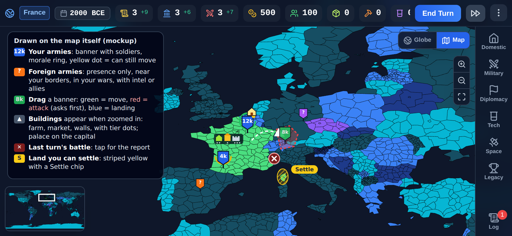

# Plan: landscape mobile, Civ-style research, a living map, working advisors, battle reports

Date: 2026-10-01. Status: being built; each section carries its own status note, the order table in section 11 tracks the workstreams.
Supersedes Parts 1 and 2 of `plans/civ-research-landscape-units.md`, which still holds the research
background and sources. Part 3 there (unit art) continues in `plans/unit-art-brief.md`.

Each workstream below has the same layout: what the game does today (checked in the code),
the design, the engine and UI work, tests, and a critique with the fixes it led to.
Section 8 is the sprite renderer for battle units. Section 10 critiques the plan as a whole.
Section 11 gives the order of work.

---

## 0. Facts this plan is built on (measured, not assumed)

- **2D map.** It is SVG with 4,482 province paths, d3-zoom 1x to 40x, and opens at 5x on the
  capital (`Map2DView.jsx`). A tap that misses every polygon falls back to the nearest centre
  within 24 px (`regionClickAssist.js`).
- **Globe.** react-globe.gl with polygons only. It has no zoom limit of its own and no army or
  building markers. It is the default map mode (`MapContainer.jsx`).
- **No army or building markers anywhere on the map today.**
- **Units.** A new game has 0 units. A 100-turn world (seed 11) had 252 units in only 37
  provinces, because the AI keeps them stacked. Markers are cheap: tens, not thousands.
- **Moving.** `MOVE_ARMY` moves one unit to a neighbouring province you own and costs 1 MIL per
  unit. The player starts with a cap of 3 MIL. A 5-unit stack cannot be moved in one turn.
  Fleets move along sea lanes (`isReachableBySea`). Entering foreign land is always
  `LAUNCH_INVASION` (2 MIL) or `AMPHIBIOUS_ASSAULT` and goes through `PreBattleModal`.
- **Battle odds already exist.** `battleOdds.js` runs the real auto-resolve 200 times.
  PreBattleModal shows win / take / hold percentages and a bar, but only with intelligence on
  the target (`canSeeRegionDetails`). Without intel the player sees no numbers. That is
  probably why the odds "disappeared". DefenseSheet shows a hold chance.
- **Battle reports.** `state.lastBattleReport` keeps one report: rounds, fortune, deployed IDs
  and a round log. MilitaryPanel shows it. Auto-resolved fights end in a small text toast.
  Only commanded battles get a full result screen. `MEN_PER_STRENGTH = 10` (aftermath.js)
  turns strength into soldiers.
- **Research.** An instant purchase of techPoints plus an ADM/DIP/MIL power cost. 50 techs:
  5 lines times 2 per age. Science buildings are the only real source of science.
  techPoints also come from Fund Scholars, espionage and events.
- **Advisors.** Three pools: ADM, DIP and MIL. A hired advisor only adds +level to its pool
  and costs a salary. Nothing is automated.
- **Taxes.** `SET_TAX_RATE` has 4 levels (low, normal, high, extortionate), a cooldown, and
  estate politics (burghers' loyalty, `actionPolitics.js`).
- **AI economy.** The AI already decides buildings, research, stability and recruitment
  (`aiEconomy.js`, `aiLogic.js`), but on `nation.economy`. The player uses `state.resources`
  and `state.techTree`, a different shape.
- **Mobile layout.** Below 1024 px wide the game uses a bottom tab bar and bottom sheets
  (`PanelDrawer.jsx`). Native shells exist (`android/`, `ios/`). No orientation is set.
- **Speed.** About 230 to 250 ms per turn in this sandbox at turns 50 to 100. The CPU budget
  is already tight, so new per-turn work must stay player-only or cached.

---

## 1. Landscape-first on phones

**Status: built (slice 1).** Two changes from the design below, made while building it: the tab
rail is on the **right** edge (the dock opens beside it), mirroring desktop, so the province
panel can stay on the left with both open; and **End Turn** sits in the slim top bar, where no
sheet ever covers it. The battle's max zoom on phones is 5 (was 3).

### Design
- **Phones are landscape only.** Detected as a short side of 500 px or less, plus touch.
  Tablets and desktop keep their current layouts.
- **Native app.** Lock orientation:
  - Android: `android:screenOrientation="sensorLandscape"` on MainActivity.
  - iOS: Info.plist `UISupportedInterfaceOrientations` set to landscape left and right.
- **Web on phones.** Browsers can't reliably lock orientation (iOS Safari has no
  `screen.orientation.lock`). Show a "Rotate your phone" overlay in portrait. Also try
  `screen.orientation.lock('landscape')` after entering fullscreen where the browser allows it,
  so Android Chrome can lock.
- **Layout at 844x390 (base phone) to 932x430.**
  - **Top bar, 36 px.** Treasury, science, stability, date, and a research pill
    ("Bronze Working · 3"). Resources collapse to icons with numbers. Tapping one opens its
    breakdown.
  - **Left rail, 56 px.** Domestic, Military, Diplomacy, Research, Space and Log, as icons with
    tiny labels and badges ("2 idle armies", "research done").
  - **Right dock, 38% wide, at most 380 px.** The open tab's content. It scrolls inside itself
    and collapses with a swipe right or by tapping the open tab again. The map stays live
    beside it.
  - **Bottom right.** A large End Turn button, above a small Fast-forward button.
  - **Sheets.** Modals (province, pre-battle, events, research choice) become right-hand side
    sheets the height of the screen, never bottom sheets. A full-screen moment such as a
    battle report or an age change can use a centred card at most 92% of the height.
  - **Notches.** Use `env(safe-area-inset-left/right)` so nothing sits under the notch or the
    home bar.
  - **Text and targets.** Minimum text 11 px. Tap targets at least 40x40 px.
- **One layout switch.** Add a `useLayoutMode()` hook that returns `desktop`,
  `phone-landscape`, `phone-portrait` or `tablet`. It replaces the scattered `useIsMobile`
  width checks (`max-width: 1023px`), which would wrongly treat a phone in landscape
  (844 px wide) as mobile portrait.

### Work
1. Add `useLayoutMode`, then migrate `useIsMobile` callers to it.
2. Build a `GameShell` with three slots (top bar, rail, dock) and move ActionPanelTabs and
   ActionPanel into it. The panel bodies stay the same at first.
3. Make each panel fit 380x350 px. The dense ones are Domestic, Military and Diplomacy: give
   them collapsible sections, sticky section headers and no fixed heights.
4. Turn sheets into side sheets: ProvinceModal, PreBattleModal, EventModal, DefenseSheet,
   PeaceOfferSheet and the new research sheet.
5. Add the rotate overlay and the native orientation lock (Capacitor config, then
   `npx cap sync`).
6. The battle screen is already landscape. Check its HUD at 390 px height.

### Tests
- Add Playwright projects for phone landscape (844x390, touch) and phone portrait
  (390x844, which must show the overlay).
- Screenshot every tab and every sheet in landscape.
- Assert there is no horizontal page scroll and every button sits inside the viewport.

### Critique and fixes
- **Height is the scarce resource now.** At 390 px tall, the top bar, a sheet header and a
  footer leave about 300 px. Some current sections (Domestic court, laws) are long.
  Fix: collapsible sections, and a rule that a panel never needs two scroll areas.
- **Portrait web players get blocked.** The overlay is a hard stop.
  Fix: a "Play in portrait anyway" link that keeps today's layout, remembered in
  localStorage. That costs nothing because the portrait layout already exists. Removing
  portrait later is a separate decision.
- **This touches every panel.** It is the riskiest piece for regressions.
  Fix: do it first, behind the layout hook, with screenshot tests, so every later feature's
  UI is built once for the new shell instead of twice.

---

## 2. Civ-style research, with a choice popup at the start and after each tech

**Status: built (workstream 4, slices 1 to 3).** Science (tech points) builds up each turn
toward the current tech, with leftovers carried over, progress kept when switching and a queue.
Picking a later tech queues its missing earlier ones. ADM, DIP and MIL no longer pay for research.
Science from development is 0.02 x development. Costs by age were calibrated on the balance sim
(median science is about 9 to 10 a turn in every age) to 40 / 85 / 135 / 140 / 290. The median
AI nation reaches 7 techs by turn 30, 15 by 95, 22 by 195 and 30 by 295, against targets of 7,
14, 21 and 28. The choice sheet is a non-blocking corner card; a top bar pill shows the current
tech and turns left. The AI pays its science into research every third turn, staggered. Boosts
(slice 4) and the soft year gate (slice 5) are not built yet.

### Engine design (follows the add-mechanic skill)
- **Science per turn**, shown as `+N`:
  `science = base 2 + Science buildings + round(totalDev x 0.02) + modifiers`.
  - The development share ties growth to research.
  - Fund Scholars becomes a one-off lump of science (unchanged value).
  - Espionage steals science into the thief's current research.
  - Event techPoints add to current research.
- **State.** `research = { current: techId|null, queue: [techId], progress: { techId: pts },
  bank: pts }`. The player's copy lives on `state.research`. Each AI nation keeps its own
  copy on `nation.research` (parity).
- **Each turn**, in the income phase:
  - Science goes into `current`.
  - On completion the tech is researched, its effects apply (tech age advance unchanged), the
    overflow moves to the next queued tech, and an event is logged.
  - With no current tech, science goes into `bank` and nothing is lost. The bank pays into
    the next pick at once (Civ-style overflow).
- **Switching** keeps the partial progress on each tech.
- **Picking a locked tech** queues its missing prerequisites in order (a path). With 5
  linear lines this is always one line, so it is simple.
- **Cost.**
  `cost(tech) = AGE_BASE[age] x speedMult x diffusion x agesBehindMult x (1 + sizePenalty)`.
  - AGE_BASE is fitted with balance-sim so the median nation finishes 6 to 8 of an age's 10
    techs before the calendar age ends. Rough starting points: 4, 9, 14, 14 and 28 turns per
    tech by age.
  - speedMult follows game speed (Fast halves turn length, so costs halve too).
  - `diffusion` is today's `withDiffusion` (cheaper next to knowers, +20% as a pioneer).
  - sizePenalty is optional: +0.5% per province above 10, capped at +30%.
- **Power pools leave research.** ADM, DIP and MIL no longer pay for techs. Research Focus
  becomes +10% science toward the focused line instead of a power discount.
- **Calendar gate.** Keep the hard `yearAvailable` gate in the first slice, so balance can be
  compared like for like. A soft "+50% before its year" is slice 5.
- **Boosts ("Eurekas"), slice 4.** Each tech gets one trigger worth 40% of its cost, from
  things the engine already tracks: own a deposit, win a battle or siege, build a tier,
  sign a pact, reach a population, launch a ship.
- **AI.** `aiEconomy` stops buying techs. Each AI nation's science accumulates the same way.
  When it has no target, it picks one by `DOCTRINE_TECH_CATEGORY_PRIORITY` (deterministic).
  This is one addition per nation per turn, so it is cheap.
- **Save migration.** `saveMigrations.js` keeps researched techs, sets research to empty and
  converts the old techPoints stock into `bank` one for one.

### The choice popup
- **Game start.** After onboarding, a "Choose your first research" sheet opens. It shows:
  - three suggested cards, one per doctrine-relevant line, with name, effect in plain words,
    cost, turns ("6 turns at +4"), and the boost hint once boosts exist;
  - "Show full tree", which opens the Research tab;
  - "Let my advisor choose", which picks by doctrine and turns on the research advisor
    (section 5).
- **On completion.** If the queue is empty, the same sheet opens at the start of the
  player's next turn, headed "Bronze Working researched: +10% copper" with a short flourish.
  It shows the next three picks.
- **It never blocks.** End Turn stays usable and science banks. That avoids adding another
  "resolveTurn does nothing while…" lock, a known pitfall in this codebase.
- **The queue avoids nagging.** Picking a tech three steps ahead queues the path, so the
  popup only appears when the queue runs out. A setting can turn the popup off entirely.
- **Research tab.**
  - Current tech with a progress bar and turns left.
  - Queue chips that can be reordered by drag and removed with an x.
  - 5 line columns as horizontal scrollers in landscape.
  - Each card shows cost, turns, progress, diffusion or pioneer badges and the boost.
- **Top bar pill.** Shows "Researching X · N" and opens the tab.

### Tests
- **Unit:** accumulation, overflow, switching keeps progress, the queue path, banking, cost
  edges, migration.
- **Integration:** with `resolveTurn` and a fixed seed, the first tech completes on the
  predicted turn.
- **longRun determinism:** unchanged in spirit.
- **balance-sim:** median techs per age, before and after.
- **e2e:** a new game shows the sheet. Pick a tech, end turns until it completes, and the
  sheet appears again.

### Critique and fixes
- **Calibration is the real work.** A bad AGE_BASE either races to the Modern age or stalls in
  the Bronze age. Fix: calibrate in its own slice with balance-sim on 2 seeds and 150 turns,
  and change nothing else in the same commit.
- **Power pools lose their main sink.** That inflates ADM, DIP and MIL. Fix: check in
  balance-sim that the pools still drain through stability, laws, development and
  diplomacy. If they sit at the cap, add a sink there, not in research.
- **AI parity.** If the AI keeps buying instantly while the player waits, the comparison is
  unfair. Fix: both use the same accumulation function, tested together.
- **A popup after every tech feels like nagging.** Fix: a queue, "let my advisor choose",
  and an off switch.

---

## 3. Mobile zoom and tapping small provinces

**Status: built (workstream 5).** On touch, a tap samples a 18 px ring around the finger; two or
more provinces under it open a small chooser (globe and flat map). The flat map zooms to 80x on
touch devices (40x with a mouse). The globe-to-flat hand-over comes with the super zoom (4f).

### Problem
Small nations such as Israel, Lebanon and the Gulf states have provinces a few pixels wide
at normal zoom. Zoom alone doesn't fix a fingertip that covers about 45 px.

### Design (ranked)
1. **Tap disambiguation.** Recommended, and the biggest win. On touch, when a 44 px circle
   around the tap overlaps two or more provinces, open a small floating chooser beside the
   finger. It lists up to 5 province names with owner flag colours, ordered by distance.
   One more tap picks a province. One province under the tap acts at once, as today.
   Hit-testing reuses the projected centres plus a bounding-box overlap test (cheap: only
   provinces inside the circle's box).
2. **More zoom on mobile.**
   - Flat map: raise the 2D cap from 40x to 80x on touch devices.
   - Globe: clamp `controls.minDistance` so it gets closer than today. At a very low
     altitude the globe is the wrong tool, so offer "Switch to flat map here" as a chip when
     the player pinches past it. Don't switch automatically, because that is disorienting.
   - Double-tap zooms 2x on the tapped point.
3. **Smart zoom.** Tapping a tiny province at low zoom first zooms in on it (to where it is
   at least 48 px wide) and only selects it on a second tap. This is optional and can feel
   slow, so it is off by default.

### Tests
- Unit-test the chooser candidate function (overlaps and ordering).
- e2e at 844x390: tap a known multi-province point near Israel and expect the chooser.
  Pick the second entry and expect the province sheet for it.

### Critique
Disambiguation adds one tap in crowded spots, but it never selects the wrong province, which
is the real complaint today. That trade is right.

---

## 3b. A lighter map: fewer, evenly sized regions (the CK3 approach)

**Status: built (workstream 3).** 4,482 to 2,028 regions exactly as the dry run said; all 240
capitals kept; the v6 save migration converts old saves; turns are about 25 to 40% faster.
Supplies count the original provinces inside each region (so foraging is unchanged); gold is
lower for over-split countries because the per-province minimum development no longer
multiplies across hundreds of tiny provinces (France about -10 to -20%). Zoomed out, the flat
map draws nation borders only and the globe hides lines inside a nation.

### The problem, measured
- The map has **4,482 regions**, one per real admin-1 province, and they are wildly uneven.
- **Provinces per country.** The UK has 232, Slovenia 192, Latvia 114, Uganda 111, Italy 110,
  France 101 and North Macedonia 84. Russia has 86, China 32 and the median country 11.
  Small European countries are cut into municipalities.
- **Province area.** The smallest 10% are under 33 km². The median is 3,366 km² and the largest
  10% are over 64,000 km². The small ones are about 2,000 times smaller than the large ones.
  That is why they are impossible to tap, slow to draw, and tedious to manage (101 French
  provinces to build in, against 32 Chinese).
- **How CK3 does it.** Crusader Kings III also has a large map with thousands of provinces. It
  feels easy because:
  1. provinces are roughly the same size;
  2. the map shows the level that fits the zoom: realms when far away, provinces when close;
  3. you rarely manage provinces one by one.

  We copy all three: this section covers the first two, and delegation (section 5) covers the
  third.

### A. Balanced regions: merge over-split countries (recommended, a data rebuild)
- **New script `scripts/geo/build-balanced-regions.mjs`.** It feeds the existing geo pipeline
  (`scripts/geo/build.mjs`) a merge table, `regionMerge.json`, mapping each old id to its new id.
- **The rule, per country:**
  - target count `K = min(provinces, max(4, round(country area / 30,000 km²)))`;
  - then repeatedly merge the smallest cluster into its smallest neighbouring cluster in the
    same country, until there are K clusters;
  - islands with no land neighbour stay separate;
  - countries already at or below K are untouched. The US keeps its 51 states, China its 32
    provinces and Russia its 86.
- **Measured result** (a dry run of the rule on the real data):

  | Area per region | Regions | UK | Slovenia | France | Germany | Italy | Japan | Israel |
  |---|---|---|---|---|---|---|---|---|
  | 20,000 km² | 2,245 | 11 | 4 | 31 | 16 | 15 | 18 | 4 |
  | **30,000 km² (proposed)** | **2,028** | **8** | **4** | **21** | **12** | **10** | **12** | **4** |
  | 50,000 km² | 1,777 | 8 | 4 | 13 | 7 | 6 | 7 | 4 |

  That is **55% fewer regions**, and the tiny ones are gone. Every border is still a real border:
  a merged region is the union of real provinces, with the inner lines removed (topojson
  `merge`).
- **Each merged region:**
  - **Id and name** come from its most populous member, so capitals and most references stay
    valid. For example Ljubljana, Greater London, Île-de-France.
  - **Population, GDP and resources** are summed.
  - **Infrastructure and strategic value** are population-weighted.
  - **Terrain** is the member with the largest area.
  - **Coastal** if any member is. **Capital** if it contains the capital.
  - **Neighbours** are the union of the members' neighbours, mapped to new ids.
  - **Geometry** is the merged shape, with sea lanes, coordinates and adjacency rebuilt by the
    pipeline.
- **References.** About 30 hard-coded region ids in code and tests are remapped through the
  table. A new test checks that every region id referenced in `src/data/` exists.
- **Balance.** National totals of population, GDP and resources stay identical, because they
  are sums. But anything counted **per region** shrinks for over-split countries:
  - building slots, development, recruitment sites, unrest checks.

  That is the point: the UK no longer has 7 times China's building capacity. It still needs
  calibrating with balance-sim, before and after, on 2 seeds over 150 turns:
  - median income, buildings, army size, wars and conquests;
  - then tune slots per region to scale with population, so big regions build more.
- **Speed.** Turn phases loop over regions, so 55% fewer regions should make turns clearly
  faster. Measure it with `compare.sh` (today about 240 ms per turn here). The globe and flat map
  also draw 2,028 shapes instead of 4,482.
- **Saves.** A save migration (`saveMigrations.js`) merges each old save region by region:
  - **owner:** the owner of the most populous member. If members had different owners (a war
    split), log it in the event log;
  - **control and unrest:** population-weighted;
  - **buildings:** the highest tier per category;
  - **units:** moved to the new id.

  It is deterministic and tested on fixture saves. Old saves keep working.
- **One map, not two.** Keeping both maps would double the data, the bundle and the testing.
  Recommended: switch everyone to the balanced map.

### B. Zoom levels on the map (do both A and B)
- **Zoomed out**, the map draws **nations, not provinces**. Province fills have no outlines, and
  one mesh path draws only the borders between different owners (topojson `mesh` with an owner
  filter). It is rebuilt only when land changes hands.
  - Flat map: outlines appear from 3x zoom.
  - Globe: below an altitude of about 0.8, plus a nation-border line layer above it.
- **Tapping when zoomed out** picks the province under your finger, with the chooser from
  section 3 when several are under it. A double tap zooms into it.
- **Province labels.** Nation names are drawn across their land when zoomed out. Province names
  appear when zoomed in. A label is skipped when it doesn't fit.
- **Speed.** Thousands of stroked outlines per frame are the globe's main cost, and that is what
  makes the browser tests so slow. Drawing one border mesh is far cheaper.

### Tests
- **Merge script:**
  - the region count is within plus or minus 3% of 2,028;
  - every merged region is contiguous or an island;
  - totals are preserved per country;
  - every capital still exists.
- **Data:** a referenced-id check; the geo tests pass on the new data.
- **Save migration:** an old fixture save loads, `auditGameState` is clean and owners are as
  expected.
- **balance-sim and compare.sh:** before and after numbers in the commit message.
- **e2e:** tap tests on the new map (the stabilization spec's two-zoom-level checks).

### Critique and fixes
- **Losing real local detail.** Dutch, Slovenian and English players lose their local
  provinces. Fix: the merged region shows its member place names in its card ("includes
  Kranj, Celje…"). The 4 regions per country minimum keeps even small countries playable.
- **The balance shift is real.** Over-split countries lose per-region advantages they never
  should have had. Fix: a dedicated calibration commit with numbers, before research
  calibration, so the two don't mix.
- **History and events** that name a province by id are remapped by the table, and the test
  catches any that are missed.

---

## 4. A living map: armies, buildings, drag to move

**Everything in this section is drawn on the map itself** (on the globe and the flat map, at the
province where it is), not in a sheet or a modal. A mockup on the real map at phone size:

### 4a. A shared marker model
**Status: built (workstream 6, slice 1).** `getMapMarkers(state)` (src/utils/mapMarkers.js) and
the banners (src/components/map/mapBanners.js) are shared by both maps: an HTML overlay on the flat
map (Map2DMarkersOverlay.jsx) and `htmlElementsData` on the globe. Differences from the design:
- Buildings wait for the super zoom (workstream 8), where they stand on the land.
- Clustering is done on both maps (screen distance on the flat map, about 3 x altitude degrees on
  the globe); tapping a cluster zooms in on it. Foreign banners show from 2x zoom on the flat map
  and below the nation-level altitude (1.1) on the globe.
- The "in battle" pulse becomes the crossed-swords marker of last turn's battle (green rim for a
  win, amber for a stalemate, red for a loss).
- Fleets show the number of land units they carry as a badge.

- **One pure function** for both maps:
  `getMapMarkers(state, viewerId) -> { armies: [...], fleets: [...], buildings: [...], battles: [...] }`.
  It lives in `src/utils/mapMarkers.js`, is unit-tested and is memoised on
  `state.units`, `state.regions` and `state.wars`.
- **Own armies, one per province stack:**
  - a banner icon by dominant class (infantry, ranged, cavalry, siege, mixed);
  - total soldiers (`strength x MEN_PER_STRENGTH`, shortened as "12k");
  - a morale ring, green to red;
  - a moves-left dot;
  - an embarked badge;
  - an "in battle" pulse.
- **Foreign armies: presence only.** A smaller banner in the owner's colour with no number
  and no class. Shown only where the player could plausibly see them:
  - next to or inside their own territory;
  - in a province with an enemy at war, inside the player's war zone;
  - in a nation they have intel on;
  - in an ally's provinces.

  Otherwise there is nothing (fog). With intel, the banner may show a size band
  (small / medium / large) instead of an exact number.
- **Fleets** use a ship icon on the coast, with the same rules.
- **Battles last turn** show crossed swords for one turn. Tapping them opens the report
  (section 6).

### 4b. Rendering
- **Flat map:** an SVG `<g>` layer above the provinces, drawn at screen scale (divided by
  `transform.k`) so icons stay 28 px whatever the zoom.
  - When two banners would overlap, they merge into a cluster ("3 armies") at low zoom.
  - At most about 300 markers. Measured worlds have about 40 stacks, so it stays cheap.
- **Globe:** `htmlElementsData` handles up to about 100 DOM markers well. Above that, or for
  buildings, use a `customLayer` with instanced sprites. Markers on the far side are hidden.
- **Zoom levels (level of detail):**
  - Zoomed out: own armies plus clusters only.
  - Mid zoom: foreign presence too.
  - Close zoom (2D 8x and up, globe altitude 0.35 or lower): buildings appear.

### 4c. Buildings in the province (close zoom)
- **Icons.** A small cluster of up to 4 icons in the province, one per built category at its
  highest tier, chosen by score:
  - food = a farm, economy = a market, military = barracks, defense = walls or a fort,
    science = a library, industry = a workshop, culture = a temple, naval = a dock,
    logistics = a road or depot;
  - mines for copper, iron and oil extraction.
- **Tier pips** under each icon. Icons are age-styled (Bronze huts through Modern buildings):
  3 art variants per icon, 9 categories plus 3 mines, so 36 small SVGs. They can be made in
  code (simple vector glyphs) before final art.
- **The capital** gets a palace icon. A Great Project gets its own landmark icon.
- **Tapping** a building icon opens ProvinceModal on the buildings section.
- **Foreign buildings** show only with intel, and only walls and a palace (things visible
  from outside).

### 4d. Drag and drop to move or attack

*Extended by 4g: an army can now be sent anywhere, over several turns. The drag rules below still
apply to the first step and to targets next door.*
- **Gesture.** Press and hold an own army banner for 250 ms. It lifts, with haptics on
  native. Then drag. Pressing anywhere else pans the map as today, so dragging never fights
  panning. On desktop, a plain drag on the banner works.
- **While dragging, valid targets light up:**
  - green: a neighbouring province you own (a move);
  - red: a neighbouring foreign province with a valid attack (opens PreBattleModal on
    release, which always asks first, as the game rule says);
  - blue: for a fleet carrying troops, coastal provinces reachable by sea lane (opens the
    landing PreBattleModal);
  - for a fleet without troops, the sea-lane moves.

  Everything else is greyed out. Releasing on something invalid snaps the army back with a
  one-line reason ("Not a neighbour", "No moves left", "Needs 1 MIL").
- **Movement path.** Only one step (to a neighbour) in the first slice. A multi-step path
  (drag far, queue the steps over turns) is a later option. See the critique.
- **New engine action: `MOVE_STACK { fromRegionId, toRegionId, unitIds? }`.**
  - Moves every own land unit in the province that has moves left, or the given subset, for
    one cost: 1 MIL per stack, not per unit.
  - Today's per-unit MIL cost makes stack drags impossible at a 3-MIL cap.
  - This is a rule change, so it goes through the add-mechanic checklist. AI parity is not
    affected, because AI movement is abstract.
- **Splitting.** Tapping a banner opens the stack card with a checkbox per unit. "Move
  selected" then means dragging that card's banner.

### 4e. Settling land you can actually find

**Status:** the real cause was a bug, now fixed. The region card only showed its actions for land
with an owner nation, so frontier land (no owner) never showed "Frontier expedition", even with
an army next to it. Covered by `src/components/modals/frontierSettle.test.js`. The striped map
overlay (item 1 below) is **dropped** at the user's request; the rest stays optional.

**How it works today** (why it was hard to find):
- **"Full world" scenario: there is no empty land.** "Settle / Colonize" only works on land
  nobody governs any more: a province held by rebels, or what is left of a nation that has been
  wiped out. It must also border you, have control below 20, and you must afford the cost. It
  is rare, and the button only appears when every condition is already met.
- **"Emergent civilizations" scenario.** The world starts with free **frontier** land. "Frontier
  expedition" needs one of your land armies, with a move left, standing next to it.
  - Cost: gold 80 + 20 x claims^1.4, plus ADM and supplies.
  - The army loses men to the land's resistance.
  - The button only shows on the frontier province's card.
- **Nothing on the map tells you where any of this is possible.**

**Fixes:**
1. **The map shows it.** A pure function `getSettleTargets(state)` (unit-tested) lists every
   province you could settle or claim, with its cost and what is missing.
   - **Land you can settle now** is drawn **striped yellow with a "Settle" chip**.
   - **Frontier land** you could claim once an army stands next to it is **striped grey** with
     its resistance.

   Both stay visible at every zoom level.
2. **Drag an army onto it.** In the drag of 4d, striped land lights up yellow. Dropping on it
   runs the expedition (emergent) or settles (full world), after a one-line confirm showing the
   cost and expected losses.
3. **The card explains, never hides.** Tapping any unowned, rebel-held or abandoned province
   shows an "Expand here" block with a checklist, for example:
   - "✓ borders you"
   - "✗ control 45, needs below 20"
   - "✓ cost 80 gold, 2 ADM, 3 supplies"
   - "✗ needs an army next to it"

   The button is greyed with the reason instead of being absent.
4. **An Expansion list** in the Domestic tab: every current target, cheapest first. Tapping one
   flies the map there.
5. **A first-turn tip** in the emergent scenario: "The striped land around you is free. Drag an
   army onto it to settle." In full world, tapping foreign land says plainly: "All land here is
   claimed. You grow by war, vassals, or land that rebels or collapse leave behind."

**Tests:**
- unit tests for `getSettleTargets` in both scenarios;
- the checklist reasons match the reducer's own refusals (the same validation functions,
  `validateFrontier` and a new `validateSettle`, used by both);
- e2e: start an emergent game, the striped land is visible, drag an army onto it, the land
  becomes yours.

### 4h. Settling as a project, not a click (user request: "too easy and boring")

**Today (measured, emergent world, seed 11).** A frontier claim is one instant action: an army next
to the land, 80 + 20 x claims^1.4 gold, 2 ADM and a few supplies, and the province is yours at
once. Every AI nation claims one each turn it can afford; a player with several armies claims
several a turn. After 100 turns the biggest nation has 43 provinces and the median 12, with no
choice made along the way.

**New: a colony grows over several turns, and costs you while it does.**
- **Founding** (`FOUND_COLONY { regionId, policy }`), on free frontier land next to yours:
  - an army must stand next to it; it moves in as the colony's escort;
  - an up-front cost in gold and ADM that grows with the size of your realm, not only with the
    number of claims: gold `60 + 12 x provinces^1.15`, ADM `2 + provinces / 6`;
  - **settlers**: 4% of the population of the province they leave from (at least 2,000). The
    land needs people, and your own province shrinks for a while.
- **Colony slots.** At most `1 + age bonus` colonies at once: 1 in the Bronze Age, 2 from the
  Classical, 3 from the Gunpowder Age, plus `national.colonySlots` modifiers. This is the main
  brake: expansion becomes a pace you plan.
- **Growing.** Each turn a colony gains progress toward 100:
  `10 x terrain (open 1, hills and forest 0.7, mountains, desert, arctic 0.4) x policy
  x (1 + 0.05 x your bordering provinces, max +25%)`. About 8 to 15 turns.
  It costs upkeep every turn: 4 gold plus 2 for every other colony, and 1 supply.
- **The natives** (the land's existing `inhabitants` and `resistance`), chosen when founding:
  - **Live alongside them**: progress x0.75; on completion the inhabitants stay as your
    population, unrest starts at 20.
  - **Drive them out**: progress x1.25; the population drops to the settlers, unrest starts at 45,
    and every bordering nation's hostility rises by 5.
  - **Raids.** Each turn a seeded roll against `resistance / 250` (half when living alongside):
    a raid sets progress back by 15 and costs the escort 5% of its strength. No escort in the
    colony (it marched away) doubles the chance. Three raids in a row and the colony is lost.
- **Completion.** The province becomes yours at control 35 with the five-turn integration that
  exists today. The log and the map say so.
- **Abandon** (`ABANDON_COLONY`): the land goes back to the natives, nothing is refunded.
- **One colony per province.** A province another nation is colonizing can't be colonized.
- **AI parity.** AI nations use the same rules (slots, costs, progress, raids), picking the
  best-scoring target. So AI growth slows by the same rules, not by a special cap.

**On the map and the card.**
- A colony shows a tent marker with a progress ring (yours with the turns left; foreign ones
  under the 4a visibility rule).
- The frontier card shows "Found a colony" with the checklist (army next to it, slot free,
  cost, settlers) and the two native policies with their speed and raid risk. A colony's card
  shows its progress, turns left, upkeep, raid risk and Abandon.

**Tests:** the formula edges (terrain, policy, border bonus cap), slots, costs by realm size,
settlers taken from the source province, raids and the three-raid loss, completion, abandon,
the AI using the same validation, determinism, a save with a colony in progress.
**Balance-sim (emergent, seeds 11 and 12, 100 turns):** median and top nation provinces before
and after; the target is roughly half today's pace with the top nation under 25.

### 4f. Super zoom, CK3 style: buildings and armies standing on the land

**Goal.** One continuous zoom from the globe down to a single province. Up close you see the
province itself:
- its terrain;
- its town and buildings;
- your armies as little soldiers standing on the land (walking when they march);
- sieges and battles happening where they are.

Zoomed out, it is the clean political map again. This is what CK3 does: realms far away, holdings
and units up close.

**Zoom levels (one zoom gesture, no mode switch):**

| Level | Shows |
|---|---|
| World (the globe) | nations as single shapes, nation borders only (3b) |
| Region (flat map, 1x to 4x) | provinces, army banners (4a), battle markers |
| **Close (flat map, 5x to 40x)** | **terrain board**: real terrain look, buildings, town, armies as figures, roads, sieges |

- **Globe to flat.** Pinching in past an altitude of about 0.35 hands over smoothly to the flat
  map, centred on the same point, with a short cross-fade. Pinching out of the flat map below 1x
  goes back to the globe. The Globe and Map toggle stays for players who want one fixed view.
- **Renderer.** The close view needs hundreds of images and textures, which SVG can't do fast.
  It gets a **WebGL layer** over the flat map. It uses three.js, already in the app for battles,
  with an orthographic camera matching the d3 projection, and draws only the provinces on screen.
  The SVG stays for the region level, where it works well today.

**The terrain board (how it looks), options ranked:**
1. **Per-terrain textures plus real elevation shading (recommended).**
   - Each province is filled with a tiling texture for its terrain: fields and meadows, forest,
     hills, mountains, desert, snow, marsh.
   - It is shaded with a small world elevation map: public-domain NOAA ETOPO data, downsampled to
     4096 x 2048, about 3 MB as WebP. Mountains read as mountains, coasts get a sand edge, and
     water is animated.
   - The owner's colour becomes a thin tint and a border line, like CK3's close view.
2. **Pre-made satellite-style tiles** (Natural Earth rasters, public domain). Prettier, but
   25 to 100 MB of tiles. Too heavy for the app.
3. **Flat colours plus icons only.** Cheapest, but not the CK3 feel.

**Buildings standing on the map:**
- **The town** (user request: real models, sized by buildings). Each province has a town model at
  its centre, sized by **how many buildings the province has** (all building tiers added up):
  - no or few buildings (0 to 3): a **small town**, a few houses and a well;
  - some (4 to 9): a **medium town**, a market square, more houses, a wall ring if it has defense;
  - many (10 or more): a **big town**, dense houses, towers, a keep, the walls.
  The capital adds a palace. The style follows the age, like the buildings.
- **Models, not flat icons, up close; icons when zoomed out.** In the close view (flat map 5x and
  up) towns, buildings and armies are **3D models** drawn by three.js, the same engine and the
  same unit models (src/assets/raw-models, `npm run import:models`) as the tactical battles.
  Below that zoom they go back to the 4a banners and the building icons. The swap cross-fades over
  one zoom step so it never pops.
- **Buildings** are placed at fixed spots inside the province shape. The spots are seeded by the
  region id, so they never move:
  - farms as field patches round the town;
  - a market in the town;
  - barracks and walls round it (walls ring the town by defense level);
  - temples and libraries in town;
  - docks on the coast;
  - workshops on the edge;
  - mines on the deposit;
  - roads between neighbouring towns by infrastructure level.
- **Tier and age.** The tier shows as the building's size and detail, and the art follows the
  age: a Bronze Age granary, then a Classical villa, a medieval watermill, a factory.
- **Your provinces** show everything. **Foreign provinces** show town, walls and roads always,
  and their other buildings only with intel.
- **Tapping** a building opens the province panel on that building.

**Armies standing on the map:**
- **An army is 1 to 3 small 3D figures**, depending on its size, of its main unit type and age.
  The figures **reuse the battle unit models** (and later the sprites of section 8): the same
  art, at map size, in the owner's colour. Zoomed out they are the 4a banners again.
- **They play `Walk` while marching** (between turns, see 4g) and `Idle` when standing. They
  face the way they're going.
- A small banner above them shows soldiers and morale, as in 4a. Foreign armies follow the 4a
  visibility rule, without numbers.
- **Sieges** show a camp and siege engines round the town. A **battle** shows the two sides'
  figures clashing for that turn.
- **Fleets** are the ship models from the art brief (5.2), on the water.

**Art needed** (added to the art brief as a later phase, "map props"):
- one 3/4 top-down view per prop, no 8 directions;
- 9 building categories x 5 ages x 3 tier sizes, plus towns (3 sizes x 5 ages), walls, mines,
  docks and camps;
- about 170 small sprites, budget about 6 MB in total.

Until that art arrives, simple procedural shapes stand in (houses, field patches, wall rings).

**Speed.** Close zoom only ever shows a handful of provinces, so the board draws a few hundred
sprites at most. They are instanced, one draw call per atlas, as in the battle sprite renderer.
At region and world level none of it is drawn.

**Tests:**
- prop placement is deterministic and always inside the province shape;
- each zoom level shows the right layers;
- foreign buildings follow the intel rule;
- browser screenshots at three zoom levels on a phone in landscape;
- the frame rate stays at 50 fps or more at close zoom (sandbox measure).

### 4g. Move anywhere, over several turns, at a cost (CK3 style)

**Status: engine built (workstream 6, slice 2).** src/engine/routes.js with the SET_ROUTE and
CANCEL_ROUTE actions; the map UI (tap or drag to a province, the path with turn numbers) is slice 3.
As designed, with these choices:
- Terrain comes from src/data/terrain.js (names matched to mountains, desert, forest, hills and
  arctic). The real elevation data of the super zoom (workstream 8) will replace it.
- Step costs: open 1, hills and forest 2, mountains, desert and arctic 4; roads x2/3 in your own or a
  friend's land; enemy land at least 2. Paces: infantry and ranged 2, cavalry 3, siege 1.
  Unspent points carry over, so a siege train crosses a mountain in 4 turns.
- At war the march halts at the border of every enemy province you do not hold yet, and waits for
  you to attack (Auto or Command, as before). Winning moves the army in and the march goes on. So
  "battles on arrival" always ask first, as the rules require.
- Costs: 0.5 supplies per marching unit a turn (1 abroad), +25% of its gold upkeep that turn, and 3%
  strength per step into mountains, desert or arctic land. MOVE_ARMY lost its 1 MIL cost (it counts
  as marching instead); AI moves got the same rule.
- Not yet: AI routes against the player (Tier-1 enemies marching visibly), sea legs in a route.
  Measured: the passive-world sim is unchanged at 100 turns (same world, 122.5 vs 125 ms a turn).

**Today.** An army moves one step per turn, only into your own neighbouring provinces, for
1 MIL per unit. Attacks are separate one-step actions.

**New:**
- **Pick an army, tap any province.** The game plans the route (A* over province adjacency, the
  cheapest path by terrain and roads). The path is drawn on the map with **a number per turn**
  ("1", "2", "3") and the arrival turn: "Arrives in 3 turns, costs about 6 supplies".
  - Dragging the army works the same way: drop it anywhere, not just next door.
  - The order costs nothing to give. Marching is what costs (below).
- **Movement points per turn**, by unit type, terrain and roads:

  | | Own or allied land, with roads | Own land, no roads | Hills, forest, marsh | Mountains, desert | Enemy land |
  |---|---|---|---|---|---|
  | Infantry and archers | 3 provinces | 2 | 1 | 1, every other turn | 1 |
  | Cavalry | 4 | 3 | 2 | 1 | 2 |
  | Siege and support | 2 | 1 | 1, every other turn | 1, every other turn | 1, every other turn |

  - An army moves at its slowest unit's pace.
  - Forced March (the existing perk) adds 1.
  - The numbers are calibrated with balance-sim against how long wars take.
- **What marching costs** (the "consumes resources" part):
  - **Supplies:** each unit marching uses supplies every turn it moves, double in enemy land.
    The existing `SUPPLY_PER_CAMPAIGNING_UNIT` model in supplies.js grows a marching term.
  - **Gold:** marching armies pay 25% more upkeep that turn.
  - **Attrition:** out of supplies, or in mountains, desert or winter-hostile land, an army
    loses strength each turn. The rule is the existing hunger rule plus a terrain rate.
- **Borders:**
  - **At peace**, a route may only cross your own land, a vassal's or a military ally's.
    Anywhere else the path is drawn red: "No access to Spain: declare war or form an alliance".
  - **At war**, routes go through enemy land. Arriving in a defended enemy province starts the
    battle at **End Turn**, through the existing pending-battle flow. You still choose Auto or
    Command there, so every attack still asks first.
  - Arriving in an undefended enemy province starts a siege (existing siege rules).
  - Meeting an enemy army on the way stops the march and fights.
- **By sea.** A route that needs the sea uses a fleet with room, if one is at the coast. Otherwise
  it is drawn as "needs transport". Embarking and landing reuse the existing embark and
  amphibious rules.
- **Engine.**
  - A unit gets `route: [regionIds]` and `routeProgress`.
  - resolveTurn's movement phase spends movement points along the route, deterministically, in
    unit id order. It sets up battles and sieges on arrival, and logs "The 1st Army reached
    Lyon".
  - `MOVE_ARMY` (one step) stays and becomes a one-province route.
  - The 1 MIL per unit order cost is dropped; marching costs supplies and gold instead. This is a
    rule change, so it goes through the add-mechanic checklist.
- **Stacks.** A route is given to the whole stack in a province, or to the units ticked on the
  stack card. That replaces `MOVE_STACK` in 4d.
- **AI.** AI-against-AI war stays abstract (resolveWarProgress) to keep turns fast. Tier-1 AI
  nations at war with **you** get real routes to your border, so you see their armies coming.
  That is the same visibility rule as 4a.

**Tests:**
- route finding: the shortest by cost, no access at peace, sea routes;
- points per turn by terrain and roads;
- supply and gold charged only while moving;
- attrition;
- arrival triggers a pending battle and a siege;
- a route given before a save and continued after loading;
- determinism over 150 turns (longRun);
- balance-sim before and after (war length, conquests, the player's supplies).

**Critique:**
- **Moving anywhere makes wars faster and AI wars look static.** Fix: AI routes against the
  player, and calibrate the points so a war against a neighbour still takes several turns.
- **Turns span 1 to 25 years**, so "provinces per turn" is an abstraction, not a speed in km. It
  feels right as long as it matches war length, which is why it is calibrated, not guessed.

### Tests
- **mapMarkers unit tests:** fog rules (foreign presence hidden far away, shown at the
  border, banded with intel), stacking, clustering.
- **MOVE_STACK reducer tests:** cost once, moves left, embarked cargo, an own-province-only
  move, foreign province refused.
- **e2e:** drag a banner to a neighbour and the stack moves. Drag onto a foreign neighbour and
  PreBattleModal opens. A long press on empty map still pans.

### Critique and fixes
- **The fog decision is a design choice.** Showing every foreign army worldwide would break
  the intel system and clutter the globe. The visibility rule above keeps intel meaningful.
- **Drag versus pan is the classic touch conflict.** A 250 ms hold costs a moment but is
  unambiguous. Tap then tap-target stays as an alternative for players who prefer it.
- **Doing it twice.** Two renderers (globe and flat) is real work. The shared marker model
  keeps the logic in one place. If time is short, ship the flat map first, because that is
  where close zoom (buildings) makes sense anyway.

---

## 5. Advisors that actually do things (delegation)

### Today
An advisor only adds +level power to its pool. The player wants:
- a Domestic advisor that builds around the country;
- a Military advisor that recruits;
- an Economy advisor that sets taxes.

### Design: three delegations, each on or off
| Delegation | Linked advisor | Does each turn |
|---|---|---|
| **Domestic** | ADM | Builds or upgrades one building and develops one province, following doctrine priorities and placement scoring (food where population is high, defense on borders, science in big provinces, naval on coasts) |
| **Economy** | ADM (shared) | Sets the tax rate by unrest and treasury, adjusts army and navy maintenance in peace or war, repays loans when rich, takes a loan only to stop bankruptcy |
| **Military** | MIL | Recruits by doctrine mix and counters to known enemies (`chooseAIRecruitClass`), places new units on threatened borders, raises maintenance during a war; never declares war or attacks |
| **Research** | (any) | Picks the next tech when the queue is empty |

- **Budget guard.** Each delegation spends only above a reserve the player sets:
  - Domestic: never below 2 turns of upkeep in gold;
  - Military: keeps a manpower floor of 20%;
  - Economy: never sets extortionate taxes unless the player allows it.

  The guards are sliders on each delegation card.
- **Advisor level matters.** Without an advisor, a delegation still works but is "basic":
  - it decides every 3 turns;
  - Domestic only builds, it does not develop.

  With an advisor:
  - it decides every turn;
  - it looks ahead (saves up for a better building);
  - a level 3 or higher advisor also gives a 5% discount on the actions it takes.

  That gives hiring a visible point.
- **Every decision is a real player action.** A pure planner
  `planDelegatedActions(state) -> [action]` (new `src/engine/delegation.js`) runs at the start
  of the player's turn (in ADVANCE_TURN before `resolveTurn`). Each action is dispatched
  through `gameReducer`, so every cost, cooldown, estate reaction and log line works exactly
  as when the player clicks. No rules are duplicated. The planner reuses the AI scorers
  (`DOCTRINE_BUILDING_PRIORITY`, `chooseAIRecruitClass`, `chooseAIRecruitRegion`) through a
  small adapter, because the player's resources have a different shape from
  `nation.economy`.
- **The player sees it.**
  - An "Advisors this turn" line in the turn summary ("Built a Library in Lyon. Recruited 2
    infantry in Metz. Lowered taxes: unrest rising."). Each item can be tapped to go to the
    province.
  - Each delegation card shows its last 5 actions and a pause toggle.
  - A small advisor portrait animation plays on the map where something was built or
    recruited (reusing `triggerEffect`).
- **Overrides.** A manual action the player takes this turn in an area pauses that area's
  delegation for the rest of the turn. Delegation never undoes a player choice. For example,
  if the player set taxes by hand, Economy leaves taxes alone for 10 turns.

### Tests
- Unit tests for the planner with fixed states:
  - it never goes below a guard;
  - it respects the tax cooldown;
  - it never declares war;
  - it returns the same actions for the same state.
- A 100-turn balance-sim run with all delegations on, compared against a passive player:
  - the player's economy stays solvent;
  - no audit violations;
  - msPerTurn rises by less than 5%.

### Critique and fixes
- **Loss of agency.** An advisor that spends the gold the player was saving is infuriating.
  Fix: guards, off by default except Research. Turning it on is a deliberate toggle, and
  every action is reported.
- **The pools don't match the words.** The game has ADM, DIP and MIL, not "domestic" and
  "economy". Mapping both to ADM keeps the data model. DIP gets no delegation in this plan.
  Auto diplomats could come later.
- **The wrong place to run it.** Running the planner inside `resolveTurn` would mix player
  intent into the world phase and break the "pure world turn" rule. Running it as reducer
  actions just before the turn keeps replays exact: the same seed gives the same actions.
- **A weak AI makes a weak advisor.** If the AI's building choices are poor, so are the
  advisor's. A placement score per province (above) is better than the AI's current one, and
  the AI can adopt it later.

---

## 5b. A royal family for every ruler (why succession seemed to do nothing)

### What happens today (checked in the code)
- **Marriage, births and heirs only exist under a Monarchy.** Every nation starts **Tribal**. The
  Court panel says "Tribal: the strongest claimant takes over. Adopt a Monarchy…", and no marry
  or heir buttons show.
- **Adopting a Monarchy costs 300 ADM.**
  - ADM comes in at about +9 a turn at the start, and stability (130) and other actions spend the
    same pool.
  - So a passive player reaches it after 30 or more turns, which is longer than the whole Bronze
    Age (about 30 turns).
  - When you do adopt it, your ruler gets a spouse and an heir at once.
- **After that it works:**
  - "Marry a noble" (60 gold), or a royal marriage with another monarchy (Diplomacy, 100 gold
    and 10 DIP);
  - then each turn a 25% chance of an heir being born;
  - or "Name a relative as heir" (50 ADM, a weaker claim).

**So today, to get a wife and a son:** save 300 ADM, then Domestic → Government → Monarchy. Your
ruler comes married with an heir. If the heir dies or the ruler remarries, use "Marry a noble"
and wait for a birth (25% a turn).

### Proposed: families for everyone, as in CK3
In CK3 every ruler has a family; only the succession law differs. Do the same:
1. **Every ruler can marry and have children, whatever the government.**
   - "Marry a noble" and royal marriages work for all.
   - A royal marriage between two different government types is allowed, with smaller relation
     gains.
2. **Children are real people.** Each has a name, an age, a gender, three skills and a trait.
   They come of age at 16. Children and siblings are listed in the Court panel with ages, and a
   birth is logged and shown as a toast ("A son, Aldric, is born").
3. **The government decides who inherits:**
   - **Monarchy:** the eldest child (gender rule by age and culture, a decision for you), as
     today.
   - **Tribal:** the strongest claimant: your adult children get +20 claim, so a strong son
     usually wins, but a powerful general can take over.
   - **Republic:** an election; your children can stand with +10.
   - **Theocracy or dictatorship:** as today, with the family kept for flavour, events and
     marriages.
4. **The Monarchy price comes down** from 300 to 120 ADM for a Tribal nation founding a dynasty
   (the first adoption only). Changing government again later stays at 300.
5. **Feeds other systems:**
   - royal marriages already improve relations;
   - a married ruler gains +1 legitimacy a turn up to 60;
   - an adult heir with high MIL can lead an army as a general;
   - a succession without an adult heir costs stability (the existing crisis).
6. **The AI** gets the same family rules (it already has rulers and heirs on every nation).

### Who inherits (decision 16, designed)
- **Monarchy:** the eldest son, then the eldest daughter (male-preference primogeniture) through
  the Gunpowder Age. From the Modern Age it becomes the eldest child of any gender (absolute
  primogeniture), as most real monarchies did.
- **A new law, "Succession",** lets a monarchy switch earlier or keep the old rule. It uses the
  existing Laws system and costs, with nobility loyalty -5 for the change.
- **No living child:** the eldest sibling, then a named relative ("Name a relative as heir"). With
  nobody at all, a succession crisis, as today.
- **Regency:** a child heir (under 16) inherits with a regent. There is -1 stability a turn until
  they come of age, and the regent's skills are used.

### Tests
- marriage and birth work for every government;
- inheritance follows the government rule;
- the cost of founding a Monarchy;
- determinism over a 150-turn run;
- balance-sim succession crises and civil wars before and after (they must not rise);
- a save from before loads (old rulers get an empty family).

### Critique
- **More people, more save data.** Fix: at most 6 living children per ruler, and only the player
  and Tier-1 AI keep full families. Other AI keep a ruler and one heir, as today.
- **A cheaper Monarchy changes balance.** It is a dedicated balance-sim commit, with the
  crisis rate and civil wars compared before and after.

---

## 6. Auto-battle: odds, an animated "fight", and real battle reports

**Status: built (workstream 2).** Differences from the design below:
- the no-intel band ("Scouts' estimate") buckets the real auto-resolve chance into Likely win,
  Uncertain or Unlikely, because the army size bands of 4a don't exist yet;
- the report sheet has no factors list and no fallen commanders yet;
- `lastBattleReport` stays as it was (with its round log), next to the new `battleReports`
  history. There is no save migration: old saves start with an empty history.

### 6a. Odds again, for every fight
- **Without intel**, PreBattleModal shows nothing today. Show a band instead, worked out from
  what is visible (the size band from section 4):
  - "Likely win (60-80%)";
  - "Uncertain (35-65%)";
  - "Unlikely".

  Exact numbers still need intel. This keeps intel valuable and never shows a blank.
- **The same odds component** is used in PreBattleModal, DefenseSheet and the naval
  engagement (one `OddsBar` component).

### 6b. The "fighting" animation before the result
- **Honest drama, not fake drama.** When the player presses Auto-resolve:
  1. The result is computed first, as today: the same seed and rules.
  2. A 2.5 to 3.5 second sequence then plays the battle's real course:
     - two strength bars (blue and orange) facing each other, shrinking round by round
       from the battle's actual numbers;
     - the win-chance needle moves with them, recomputed from the strength left;
     - small hit sparks, a shake on a heavy round, and a "Routed!" stamp when a side breaks.
  3. The result card appears.

  Tap to skip. With reduced motion, show the result straight away.
- **Data.** `resolveBattle` already returns `report.rounds` and a `log`. Add a compact
  `report.timeline = [{ round, att, def }]` (strength after each round, a few integers) so the
  animation doesn't parse log text. This touches only the battle report shape, not the
  outcome, so the golden battle tests and replays stay exact.
- **Small multiples during resolveTurn.** When several AI attacks on the player auto-resolve
  in one turn, the turn summary plays them as a row of mini bars, one per battle, about 1.5
  seconds each, all at the same time.

### 6c. Battle reports
- **Keep a history.** `state.battleReports` holds the last 30, newest first. It replaces the
  single `lastBattleReport`, which is kept as an alias for one release. Each entry has:
  - turn, year, province, attacker and defender, outcome, captured;
  - each side's units with class, strength before and after, and routed;
  - **soldiers fallen and wounded** = strength lost x `MEN_PER_STRENGTH`. Routed units' losses
    count as fled, not fallen;
  - commanders fallen (from `resolveCommanderCasualties`), rounds, terrain, the main factors;
  - control change and devastation.
- **The report card** (side sheet in landscape):
  - the outcome banner;
  - a "Fallen: 4,200 of ours, 7,900 of theirs" headline with two proportion bars;
  - a per-unit table (icon, before and after, lost);
  - the strength-over-rounds chart (the same timeline as 6b, as a small line chart);
  - the factors list ("Terrain: hills x0.85", "Walls x0.70");
  - a link to the province.
- **The Military tab** gets a "Battle reports" list (the last 30) with filters (mine, wars,
  lost). The map's crossed-swords marker opens the matching report.
- **AI against AI battles** are abstract (`resolveWarProgress`), so they get no detailed
  report. At most a log line ("Rome won near Capua"). That is honest and cheap.
- **Size.** 30 reports of about 1 KB each is fine for saves and cloud sync. Logs are not
  stored in the report history, only the timeline.

### Tests
- `report.timeline` exists and its last entry matches the final strength.
- The golden battle test is unchanged.
- The report history is capped at 30.
- A save migration moves `lastBattleReport` into the history.
- e2e: auto-resolve plays the animation, skipping works, and the report opens with "Fallen".

### Critique and fixes
- **An animation that shows a fake back-and-forth would be a lie** the player eventually
  notices. Fix: it plays the real rounds only.
- **A 3-second wait on every battle gets old.** Fix: tap to skip, a setting for "instant
  battles", and the sequence is at most 1.5 seconds when the odds were 90% or higher.

---

## 7. Other map and presentation upgrades, in the same direction

These are cheap once the marker layer exists.
- **War front lines.** Contested borders pulse red. Provinces being besieged show a control
  ring that depletes.
- **Unrest and rebels.** A smoke icon on provinces at high unrest, and a rebel banner for
  active rebellions.
- **Movement arrows.** An arrow shows last turn's moves (own, and foreign where visible), and
  fades in the next turn.
- **Trade and pacts.** At low zoom, faint lines between trade partners. This is optional and
  can come later.
- **Turn summary card.** At the start of each turn, a small card covers battles, research,
  advisor actions and events. Each line jumps to the place on the map.

---

## 8. Sprite renderer for battle units (the Age of Empires technique)

Goal: draw every soldier on the battlefield from pre-rendered sprite sheets made to
`plans/unit-art-brief.md` (v3). This gives realistic, smoothly animated units with real deaths,
blocks and reloads, cheap enough for a phone. The current 3D path stays as the fallback for any
unit that has no sprites yet.

### 8.1 What the battlefield does today (checked in the code)
- **Camera.** `BattleRenderer.js` uses an orthographic camera.
  - Direction `ISO_DIR (1, 1.25, 1)`, 120 units back. It never rotates.
  - Zoom runs from 0.45 to 3.
  - The view is 30 world units tall in landscape and 16 in portrait.
  - 1 world unit = 1 tile = 256 sim units (`Q`).
- **Renderer settings.**
  - ACES Filmic tone mapping, exposure 1.05.
  - Pixel ratio capped at 2 (`BATTLE_GRAPHICS.maxDpr`).
  - MSAA only when the device pixel ratio is below 2.
  - 2048 px sun shadow map.
- **Soldiers.** One layer per (age, class), holding up to 640 soldiers.
  - Each layer is a `ZoomLOD` of two InstancedMeshes: the full model, and a roughly
    50-triangle imposter used below zoom 0.72.
  - Animation is a rig in the vertex shader, driven by `aAnim = (phase, moving, fighting)`.
    That is three states: stand, walk or strike.
- **Squad layout.** The sim knows squads, not soldiers.
  - The renderer lays out `getSoldierCount()` soldiers (infantry 12, ranged 10, cavalry 8,
    siege 3, support 4, air 3) on a grid behind the squad centre.
  - Grid spacing is 0.52 / 0.95 / 1.05 / 1.5, with hashed jitter.
  - Every soldier faces the squad's heading.
- **Deaths.** When the count drops, the **highest-numbered soldiers vanish**. Those are the
  back rows, so the back of the squad dies while the front fights. They vanish instantly and
  leave blood spray plus a splat decal (`spillBlood`). There is no death animation.
- **Per-squad facts in the snapshot** (`view.js`):
  - position, facing, strength, morale;
  - `striking`, `target`, `targetKind`, `routed`, `retreating`, `fled`;
  - `hidden` (ambush), `inside` (garrison), `visible` (fog);
  - `reinforcement`, `ended`.

  Nothing exists per soldier, and nothing says "this squad was hit this tick".
- **Size on screen.** A procedural person is about 1.12 units tall times
  `MODEL_SCALE.infantry 0.88`, so about 0.99 world units. Viewed at 41.5 degrees it is about
  0.74 units tall on screen. On a phone in landscape (390 CSS px tall) that is **about 10 CSS
  px at zoom 1 and 29 CSS px at zoom 3**. At pixel ratio 2 that is **at most about 58 real
  pixels**. On a 1000 px tall desktop window it is up to about 150 real pixels.
- **Scale check.** The sim's infantry walk is 1.6 tiles per second, and the brief's walk stride
  is 1.6 m/s. So one Blender metre in the brief equals about one world unit, and foot speeds
  already match.

### 8.2 What the art brief v3 delivers (the input contract)
- **Sheets.** Per unit and action: `sprites/{age}-{class}/{age}-{class}_{Action}.webp`
  (colour, lossy, with lossless alpha) plus `_mask.png` (red = Team, green = Skin and Hair).
  Variant B sheets are `_B_{Action}`.
- **Layout.** 8 rows (directions), one column per frame, at 15 fps. A sheet is at most 4096 px
  wide and wraps into further row blocks.
- **Cells and anchors:**

  | Class | Cell | Pixels per metre | Anchor |
  |---|---|---|---|
  | People | 192 | 150 | (96, 180) |
  | Large units | 256 | 100 | (128, 240) |
  | Trebuchet | 320 | 100 | (160, 304) |

- **Direction convention.** Direction 0 faces Blender -Y, which is glTF +Z and the game's +Z.
  Directions go counter-clockwise from above in 45 degree steps. Direction 2 faces +X.
- **`sprites.json`** gives:
  - per action: frames, loop, `contactFrame`, `impactFrame`, `releaseFrame`, `holdLast`;
  - variants;
  - `skinBase #D9A07A`.
- **Team cloth** renders in neutral grey (#BFBFBF on average) with its texture kept.

### 8.3 Key sizing finding (this shapes the whole design)
- **The delivered resolution is about 2 to 4 times what a phone shows.**
  - In a 192 px cell at 150 px per metre, a 1.0 m person is about 112 px tall on screen
    (1.0 m x cos 41.5 degrees x 150).
  - A phone at maximum zoom shows them at about 58 px.
- **Memory, if loaded as delivered.** Classical infantry has about 184 sprite frames across its
  13 actions. Times 8 directions, that is 1,472 cells of 192 x 192 px.
  - That is about 54 million pixels, or **217 MB of GPU memory for one unit's colour alone**.
  - A battle typically has 6 to 10 unit types, so this would crash any phone.
- **Conclusion.** The delivery is the **master**. An import step makes small, compressed,
  trimmed game sheets from it. The game never loads the master files.

Three runtime tiers, made by the import script from the master:

| Tier | Scale | People cell | Use |
|---|---|---|---|
| `sd` | 0.5x (75 px/m) | 96 px | default everywhere; matches a phone at max zoom |
| `ld` | 0.25x (37 px/m) | 48 px | zoomed out (camera zoom below 1); replaces today's imposters |
| `hd` | 1.0x (150 px/m) | 192 px | optional, desktop and tablets at zoom 2 and up; streamed on demand, not shipped first |

**Only the actions the game can actually show are imported** (8.6). For a human unit:
- Idle, Walk, Run, Attack, Attack2, Block or Reload, Death, Rout and Victory;
- Hit and DeathAlt if the size budget allows.

IdleAlt, Charge, AimHold, Volley, Kneel and Rear are kept in the master. They get used later
when the sim can tell the renderer about those moments (8.12).

**Budget per unit**, after trimming and compression. This is the sd and ld tiers, variant A
only. A full variant B (8.13) roughly doubles it.
- Frames: about 150 imported frames x 8 directions, so about 1,200 cells.

| | sd pixels | On disk (KTX2 ETC1S) | GPU (ETC2 or ASTC, 1 byte per pixel, with mipmaps and masks) |
|---|---|---|---|
| Person | about 5 M | about 2 MB | about 8 MB |
| Cavalry, chariot, machine | about 9 M | about 3 MB | about 13 MB |

- **All 26 units:** about 60 MB on disk, or about 120 MB with full B variants.
- **A battle with 10 unit types:** about 80 to 150 GPU MB. Phones handle that, with the memory
  guard of 8.11 as a safety net.

### 8.4 The import pipeline: `npm run import:sprites` (new `scripts/import-sprites.mjs`)
Input is the GPT delivery folder, `terra-imperium-units/sprites/{age}-{class}/`, kept **outside
git**. Output is `public/sprites/{age}-{class}/` (Vite copies it into `docs/`).

For each unit:
1. **Validate** `sprites.json` against a schema (new `src/battle/sprites/manifest.js`, shared
   with the runtime):
   - cells, anchors and fps are as the brief says;
   - every runtime action is present;
   - frame counts match the sheet sizes;
   - `contactFrame`, `impactFrame` and `releaseFrame` are inside their frame range;
   - mask and colour sheets have the same size.

   It fails with a readable list of problems. That is what I send back to GPT.
2. **Decode** the WebP and PNG files with `sharp`, a new devDependency that handles both. The
   mask is checked to sit inside the colour pass's alpha.
3. **Make the tiers.** Downscale each cell to 0.5x and 0.25x with a Lanczos filter, in
   premultiplied alpha so edges don't get dark halos. Anchors scale with the cell: (48, 90) for
   people in sd.
4. **Trim** each cell to its opaque bounding box plus 2 px of padding. Store the offset from the
   anchor. About 55% of each cell is empty, so this saves about half.
5. **Pack** all trimmed frames of all actions and directions into **2048 x 2048 pages** with a
   max-rects packer, for both colour and mask. A person in sd fits in about 2 pages (3 with variant B);
   a horse in about 3 to 4.
   - Colour pages are RGBA.
   - Mask pages are RG at half resolution again. The mask is smooth, so that costs nothing
     visible.
   - Pad 4 px between frames and limit mipmaps to 4 levels so neighbours never bleed.
6. **Encode** pages to **KTX2 (Basis Universal)**.
   - ETC1S for sd and ld, which is small on disk.
   - UASTC for hd, which is higher quality.
   - Encoded with `basisu` (KTX-Software). If the binary isn't available in CI, use a WASM
     encoder from npm. This is checked on the first run.
   - **Fallback:** the same pages as WebP, for browsers without KTX2 support.
7. **Write `{age}-{class}.atlas.json`.**
   - Pages, tier, scale, the frame table and the action table:
     `{ frames, loop, fps, contact, impact, release, holdLast, variant }`.
   - Each frame-table entry is `[page, x, y, w, h, offsetX, offsetY]`, indexed by
     action, direction, frame and variant.
   - `worldPerMetre`, the conversion from sprite metres to world units (8.5).
8. **Report** pixels, pages, disk size and GPU estimate per tier. Fail if over budget.
9. **Contact sheet.** Write `reports/sprites/{age}-{class}.png` with every action and direction
   at sd scale, tinted blue and orange, for a quick human review.

Tests for the import script use a small synthetic sheet made inside the test: 2 actions, 8
directions and 3 frames of coloured boxes with a known anchor. The test asserts:
- trimming, packing and offsets reproduce each frame's anchor exactly;
- the frame table is complete;
- a broken manifest fails with the expected messages.

### 8.5 Drawing a sprite exactly where the 3D model would be
- **One quad per soldier, in the camera's plane.** The camera never rotates, so every quad
  shares one fixed orientation (the camera's rotation). No per-frame billboard maths is needed.
- **Anchoring.**
  - The quad's anchor point (the feet) is placed at the soldier's ground point
    `(x, heightAt(x, z), z)`. Flying units are placed at their flight height, with a ground
    shadow.
  - The quad's size and offset come from the frame table:
    `worldWidth = w / pixelsPerMetre x worldPerMetre`, and the same for height and offsets.
  - Pixels per metre is measured in the image plane, which is what an orthographic Blender
    camera with `ortho_scale = cell / pixelsPerMetre` produces. **This has to be stated to GPT
    (8.13).**
- **Why it lines up.** An orthographic render projected onto a plane parallel to the image
  plane is exact. A sprite rendered with the game camera, drawn on a camera-facing quad, lands
  pixel for pixel where the same 3D model would.
- **`worldPerMetre`** is per class, fitted so a sprite soldier is the same height on screen as
  today's model: people about 0.99, so the size of everything else in the battle (buildings,
  spacing, rings, bars) stays right. It is overridable per unit in the atlas.
- **Depth.** The quad sits at the soldier's foot depth, with depth testing and depth writing on.
  Overlapping soldiers sort correctly: the nearer one hides the farther one, as in any
  isometric game. Terrain in front of the feet still hides them correctly (behind a ridge).
- **Edges.** Alpha test at 0.4 on mipmapped textures. MSAA is off at pixel ratio 2, so there is
  no alpha-to-coverage. At pixel ratio 2 the aliasing is invisible, and at pixel ratio 1 MSAA
  is on. No sorting pass is needed.

### 8.6 The animation state machine (per soldier, in the renderer, never in the sim)
Each soldier gets a small state record in a new `src/battle/render/spriteAnimator.js`:
`{ action, startTime, rate, dir, variant, skin, slot }`.

Time is **battle time**: sim tick plus interpolation, divided by 20. So animations pause with
the battle, run 3x at 3x speed, and screenshots stay deterministic.

| Situation (from the snapshot) | Action | Detail |
|---|---|---|
| not moving, no target | `Idle` | start offset hashed per soldier so a squad doesn't breathe in unison |
| moving at walk speed | `Walk` | playback rate = ground speed / stride speed (1.6, 3.2 or 0.9 m/s by class), clamped to 0.7 to 1.4x so feet don't skate |
| moving faster than 1.3x walk, or the order is attack and the target is within 4 tiles | `Run` (cavalry closing on a target: `Charge` if imported, else `Run`) | |
| `striking`, melee unit | `Attack` or `Attack2` | chosen per soldier per strike cycle by hash (about 70/30), so the line looks alive; the clip is timed so `contact` lands on the squad's strike tick (8.7) |
| `striking`, bow unit | `Attack` then `Reload` | the pair is stretched to the squad's `attackTicks` (ranged 1.4 s); if the cycle is longer than the clips, the soldier waits at the end of `Reload` (arrow nocked) |
| `striking`, gun unit at range | `Attack` then `Reload` | as above |
| gun unit with its target in melee reach (musketeers) | `Attack2` (bayonet) | |
| `striking`, machine | `Attack` then `Reload` | stretched to `attackTicks` (siege 3 s) |
| squad took damage this tick, melee | front row: `Block`; 1 to 2 others: `Hit` | cosmetic, from strength or morale dropping; never interrupts a running Attack before its contact frame |
| squad took damage, ranged or support | 1 to 2 soldiers `Hit` | |
| `routed` or `retreating` | `Rout` | sprite direction flipped 180 degrees, as today |
| battle `ended` | winners `Victory`, losers `Rout` (if still on the field) | |
| `hidden` (ambush) | the current action, drawn lighter and semi-transparent | |
| `inside` a building, or not `visible` | not drawn | as today |
| soldier just died | `Death` (or `DeathAlt` by hash) as a **corpse** (8.8) | |

**Direction.** `dir = round(heading / 45 degrees) mod 8`, where `heading = atan2(fx, fz)`. The
convention is fixed by a unit test against the brief: +Z is 0, +X is 2, -Z is 4, -X is 6.
- A **5 degree hysteresis** stops a soldier flickering between two directions near a boundary.
- **Facing rule:**
  - soldiers attacking a target face **the target** (bearing from the soldier to the target
    squad centre), so archers and guns aim where they shoot;
  - soldiers that are moving face their movement direction;
  - everyone else faces the squad heading;
  - plus a hashed plus or minus 10 degrees per soldier, so a squad isn't perfectly uniform.

**Transitions.**
- Looping clips switch at once.
- One-shot clips (`Block`, `Hit`) run to their end, then return to the state's action.
- `Attack` is never cut before its contact frame.
- A move order cuts any action except `Death`.

**Variety.**
- Variant A or B is chosen per soldier by hash (about 50/50).
- Skin tone is one of the brief's four tones, hashed per soldier (the existing
  `writeSoldierVariant` already hashes a skin tone).
- Clip start offsets are hashed.

**Variant B rule.** If variant B lacks an action, a B soldier uses A for it. That makes the kit
visibly change mid-battle, so 8.13 asks GPT for B versions of every runtime action instead.

### 8.7 Syncing strikes with damage, sound and blood
- **The snapshot needs a strike tick.** Today it only has `striking`, true within the last
  attack cycle. Add `strikeTick: q.lastStrikeTick` to `view.js`. It is a plain number, a
  display-only field, and doesn't affect the sim.
- **Timing the clip.** When a squad's `strikeTick` changes, each soldier starts its attack clip
  so that its contact frame lands on that tick plus a hashed 0 to 0.25 s. That keeps a squad
  from moving like one machine. Blood spray from that squad's losses is emitted at the contact
  time.
- **Deaths.** The death clip's fall-to-ground frame (`groundFrame`, see 8.13) triggers the blood
  pool and the splat decal. The pool appears when the body lands, not at the moment of death.
- **Ranged.**
  - The arrow, bolt or shell projectile effect starts at the `contact` (release) frame.
  - Baked muzzle flashes and smoke in the sprite (`fx_flash`, `fx_smoke`) replace the game's own
    flash for sprite units, so there is no double flash.
  - Tracers and projectiles stay as game effects.

### 8.8 Death, corpses and stable soldier slots
- **Stable slots.** Each squad keeps a list of soldier slots (formation positions). It is no
  longer `0 .. n-1` recomputed every frame.
- **Who dies.** When the count drops, the soldiers removed are the ones **nearest the enemy**:
  the front row toward the target, chosen by hash among ties. The back rows no longer die while
  the front fights.
- **Corpses.** A dead soldier becomes a **corpse instance**:
  - it plays `Death` at its last position and direction, holds the last frame, and gets the
    blood pool at the ground frame;
  - corpses last 25 s of battle time, then fade out over 2 s;
  - at most 300 corpses, the oldest fading first. Corpses are drawn in the same sprite mesh, so
    there are no extra draw calls.
- **Closing ranks.** Survivors keep their slot positions. When the squad is not in contact for
  2 s, the formation is recomputed for the new count. Each soldier then **walks** (Walk clip) to
  its new slot at walk speed instead of teleporting.
- **Per-soldier position.** Today positions come straight from the squad centre. Now each soldier
  has its own smoothed position that follows its slot target with a short ease (about 0.25 s).
  That gives natural movement when the squad turns. It is the same data needed for closing
  ranks.
- **Vehicles and machines.** They play their `Death` (breaks, tilts, smokes) and stay as wrecks
  for the whole battle, capped at 40. A scorch decal is placed as today.

### 8.9 The shader (new `src/battle/render/spriteMaterial.js`)
**Per-instance attributes** (one InstancedMesh per unit type and tier, shared by both armies and
by corpses):
- `aPos` (vec3, foot position);
- `aFrame` (float, the frame-table index);
- `aTeam` (vec3, army colour, linear);
- `aSkin` (vec3, skin tone, linear);
- `aFx` (vec4): fade, hit flash, highlight, ambush lightening.

**Vertex shader.**
- Reads the frame rect and offset from a small float **DataTexture** (the frame table: one texel
  row per frame, page index plus rect plus offset). This is the same trick as the existing rig
  shader's data.
- Builds the quad corners in camera right and up vectors from that size.
- Applies the anchor offset.

**Fragment shader.**
1. Sample colour from a **texture array** (`sampler2DArray`, one layer per page). That way a
   whole unit is **one draw call** whatever page a frame is on. Sample the mask from its own
   array.
2. `discard` if alpha is below 0.4.
3. **Team tint**, in linear space:
   `col = mix(col, col * aTeam / TEAM_GREY, mask.r)`, where `TEAM_GREY` is #BFBFBF in linear
   (0.52). Grey cloth becomes dyed cloth and keeps its folds.
4. **Skin:** `col = mix(col, col * aSkin / SKIN_BASE, mask.g)`, with `SKIN_BASE` = #D9A07A in
   linear.
5. **Routed:** blend toward grey by 0.6, as today. **Selected:** brighten by 0.2, as today.
   **Hit flash:** add white times `aFx.y` for 0.1 s.
6. **Fog:** apply `FogExp2` with the scene's colour and density, so sprites melt into the haze
   like the terrain does.
7. **Tone mapping and colour.** No tone mapping: `toneMapped: false`, because the sprite is
   already tone-mapped by Blender's Filmic. Textures are tagged `SRGBColorSpace`, so three.js
   decodes them to linear for the tint maths and encodes them back to sRGB once.

**Brightness match.** Blender's Filmic and three.js ACES are close but not identical. A
calibration step in the pilot measures the mean brightness of the sprite soldier against the
current 3D soldier rendered in the same scene (both screenshots in battle-lab). It sets one
global `SPRITE_EXPOSURE` multiplier (expected about 0.95 to 1.05), plus an optional per-unit
override in the atlas.

**Night, weather and dynamic light.** The sprite light is baked from the game's fixed sun,
which never changes in battle today. If dynamic time of day is ever added, sprites would need
normal maps. That is out of scope and noted in the critique.

### 8.10 Shadows
- **Option 1 (recommended):** shadow proxies.
  - Keep each soldier's existing **3D imposter** (about 50 triangles, already animated by the
    rig shader) in the **shadow pass only**: `colorWrite false`, `castShadow true`, drawn with
    the same instance positions.
  - Soldiers keep real, sun-correct, animated shadows on the terrain, with no extra art. The
    cost is about what the low level of detail costs today in the shadow pass.
- **Option 2:** blob shadows (a soft ellipse decal per soldier, offset along the sun direction).
  - Cheaper and always works; used for the `ld` tier and for aircraft.
- Sprites themselves **receive** no scene shadows. A soldier standing in a building's shadow
  would look too bright, so blob darkening from shadows is not attempted.
  - Optional later: sample the shadow map at the foot point and darken the whole sprite by it.
    That is one texture read per fragment.

### 8.11 Loading, tiers, memory and fallbacks
- **New `src/battle/sprites/spriteLibrary.js`.** `preloadUnitSprites(units, tier)` runs next to
  the existing `preloadUnitModels` before a battle opens.
  - It loads only the units that battle needs.
  - It uses three's `KTX2Loader`, with the Basis transcoder (WASM) copied into `public/basis/`.
  - It reports progress to the battle loading screen.
  - It has a 6 s per-unit timeout. On timeout or error, **that unit falls back to the 3D path**,
    so a bad file can never block a battle (the same rule as the GLB models today).
- **Tier choice.**
  - `sd` is always loaded.
  - `ld` is loaded with it, and is small.
  - `hd` is only requested if the device reports `navigator.deviceMemory` of 6 GB or more (or
    a desktop GPU), the canvas is at least 900 px tall, and the camera zoom passes 2. It
    streams in and swaps without a hitch, and is evicted when the player zooms back out.
- **Zoom LOD.** The quad uses `ld` below zoom 1.0 and `sd` above. The switch uses the
  `ZoomLOD` hysteresis that already exists. `ld` replaces the current 3D imposters for sprite
  units, so the far view gets better, not worse.
- **Memory guard.** Before loading, add up the GPU estimates from the atlas reports. If a battle
  would pass 160 MB (very large mixed battles), drop to `ld` for the least common unit types.
- **Caching.** The browser HTTP cache handles the web. Capacitor bundles the files in the app,
  so a phone needs no download. Files are content-hashed so updates aren't served stale.
- **Mixed battles.** A unit type without sprites draws in 3D next to sprite units. The style
  difference is visible, which is why sprites roll out **one whole age at a time** (matching
  the brief's phases).
- **Feature flag.** `BATTLE_GRAPHICS.sprites = true`, with `?sprites=0` in the URL to compare
  in the sandbox. There is no player setting; the user asked for fewer presets.

### 8.12 Performance plan
- **CPU per frame.** Up to 64 squads x 12 soldiers is 768, plus up to 300 corpses. Each needs a
  state update, a direction, a frame index, and 12 floats written into the instance buffers.
  That is well under 1 ms. Only the used range is uploaded, as today.
- **GPU.** About one draw call per unit type per tier (plus shadow proxies). That is fewer than
  today's two levels of detail.
  - Overdraw is the main cost: trimmed quads are about 45% of a cell.
  - Alpha-tested `discard` disables early depth rejection on phone GPUs, but at about 1,000
    small quads the fill cost is a fraction of the terrain's.
- **Targets.** Measured in the sandbox at 64 squads with the existing `frameSummary`:
  - no slower than today's 3D path on desktop;
  - at least 50 fps on a mid-range phone, tested with Playwright's phone emulation (CPU 4x
    throttled) and checked once on a real phone through the app build.
- **Things the sim doesn't tell the renderer yet.** These are follow-ups. Each needs one
  display-only field in `view.js`:
  - `Volley` (ranged attack orders at long range);
  - `Kneel` (riflemen holding);
  - `Charge` (the charge bonus is active);
  - `Rear` (cavalry stopped by pikes).

### 8.13 Changes to send back to GPT (brief v3 corrections)
1. **Define pixels per metre exactly:** "orthographic camera, `ortho_scale = cell /
   pixelsPerMetre` metres, so 192 / 150 = 1.28 m for people, 256 / 100 = 2.56 m for large
   units, 320 / 100 = 3.2 m for the trebuchet." Without this, two units can come out at
   different sizes.
2. **Variant B gets every action the game uses:** Idle, Walk, Run, Attack, Attack2, Block (or
   Reload), Hit, Death, Rout and Victory. Otherwise the kit changes in the middle of a fight.
   Alternatively drop variant B and rely on the skin mask plus slight hue variation. Decision
   for you.
3. **Add `groundFrame` to every `Death`** (the 0-based frame where the body hits the ground), so
   blood pools appear at the right moment.
4. **For `Attack` + `Reload` pairs**, the last frame of `Reload` must flow into frame 0 of
   `Attack` (the game chains them).
5. **Name the masters by tier:** deliver at the brief's sizes, and note in the log that the game
   downscales to 0.5x and 0.25x. Small details (thin bowstrings, rivets) should survive 0.5x.
   Validation adds a check that renders the sd version and confirms the silhouette still reads.

### 8.14 Building it before GPT's art arrives
- **Placeholder sprites from our own units.** A new `scripts/bake-placeholder-sprites.mjs` runs
  in headless Chromium (Playwright, already installed). It renders today's procedural soldiers
  (or the pilot GLB) with the exact game camera and sun into sheets laid out like the brief:
  8 directions, 15 fps, masks from a team-only and skin-only pass. Actions: Idle, Walk and
  Attack, plus a simple tipping-over Death made by rotating the model.
- **The whole pipeline can be built and tested on placeholders now:** import, atlas, renderer,
  state machine, corpses, shadows, budgets, phone speed.
- **When GPT's realistic pilot arrives**, it drops into the same folder and only the art
  changes.
- **Every unit gets sprites from day one** (placeholder quality), so mixed battles never mix
  styles. Each unit is replaced as its real art is approved.

### 8.15 Tests
- **Unit tests:**
  - direction from heading, all 8 plus hysteresis, plus the brief's convention;
  - frame selection: loop, hold last, rate clamping, contact-time alignment;
  - state machine transitions from scripted snapshots: walk, strike, damage, rout, end;
  - "who dies" picks the front row;
  - corpse cap and fade;
  - closing-ranks targets;
  - manifest validation;
  - tier and memory budget calculation;
  - the import script on synthetic sheets (8.4).
- **Battle-lab browser checks** (the screenshot skill gains a `SPRITES=1` option):
  - screenshot sprite and 3D versions of the same battle side by side at phone size
    (844x390, pixel ratio 2) and at desktop size;
  - the console has no errors;
  - the fps summary is printed.
- **Fallback test:** remove one unit's atlas and the battle still opens with that unit in 3D.
- **Replay tests are unchanged.** All of this is renderer-only, and the sim and replays stay
  exact. `view.js` gains only display fields (`strikeTick`).

### 8.16 Critique and fixes
- **Delivered size versus phone reality.** The brief's 192 px cells are about 2x what a phone
  can show. Fix: keep them as masters, ship sd and ld, and stream hd only where it helps.
  - Also worth doing: the landscape work (section 1) should raise the battle's maximum zoom on
    phones from 3 to about 5. Otherwise even sd is more detail than ever reaches the screen,
    and the realistic art goes unseen.
- **The repo and the site would bloat.** About 60 to 120 MB of game sprites goes into `public/`, and is
  then copied into the committed `docs/`. Each art revision adds to git history forever.
  - Fix: masters never enter git. Game sprites are regenerated, and only the final approved
    version of each unit is committed.
  - If history grows past about 1 GB, move sprite hosting to Supabase Storage (already used by
    the project) and keep only the manifest in git.
  - hd is never committed.
- **Squad-level sim, per-soldier animation.** Blocks and hits are cosmetic guesses from "the
  squad lost strength". That is honest for a squad-level sim and is how most RTS games fake
  it. Their rate is kept low so it doesn't look random.
- **Fixed lighting is baked.** If battles ever get time of day, sprites can't relight. That is
  acceptable: the camera and sun are fixed by design, and that is exactly why sprites work here.
- **Two renderers to maintain** (3D and sprites). Fix: the 3D path stays only as a fallback and
  for the sandbox comparison. New visual features target sprites first.
- **Mixed styles during roll-out.** Fixed by placeholder sprites for every unit (8.14) and by
  replacing art one age at a time.
- **Turning.** Eight directions snap in 45 degree steps. With the per-soldier smoothing and
  hysteresis, turning reads well at this size (Age of Empires II uses 8 too). If it looks
  steppy on the pilot, ask GPT for 16 directions for cavalry only. That roughly doubles their
  size.

### 8.17 Order of work inside this workstream
1. `view.js` `strikeTick`, `spriteAnimator.js` (state machine, directions, slots, corpses) with
   unit tests. Renderer-independent.
2. Placeholder bake script; import pipeline with tiers, trimming, packing and KTX2; atlas
   format; budgets.
3. `spriteMaterial.js` and the sprite layer in `BattleRenderer` behind the feature flag; shadow
   proxies; fog; tint; brightness calibration.
4. Loading, tiers, memory guard, fallback; battle loading progress.
5. Battle-lab sprite screenshots, phone speed check, then sprites on by default for
   placeholder units.
6. GPT pilot (classical infantry) import, tuning, phone screenshots for you; then age by age.

---

## 9. Mechanics touched (for the add-mechanic checklist)
| Change | Module | Feeds into |
|---|---|---|
| Science accumulation and queue | new `research.js`, resolveTurn income phase, gameReducer | tech age, buildings and units unlocked, AI economy, score |
| Power pools leave research | gameReducer `RESEARCH_TECH`, aiEconomy | ADM, DIP and MIL pools, stability, laws |
| `MOVE_STACK`, 1 MIL per stack | gameReducer | war tempo, MIL demand |
| Delegation planner | new `delegation.js`, ADVANCE_TURN | economy, buildings, recruitment, taxes, estates |
| Battle timeline and history | battle.js report, invasion.js, defense.js, saveMigrations | UI only |

Each goes through: pure module, fixed-seed tests, `auditGameState`, balance-sim before and
after, and `compare.sh` for speed.

---

## 10. Critique of the plan as a whole

1. **It is too much for one branch.** These are six projects. Fix: each workstream gets its
   own branch and its own merge, in the order below. Each one ships and is playable alone.
   The sprite renderer is the exception that can run fully in parallel: it touches only
   `src/battle/render/`, a new import script, and one display field in `view.js`.
2. **The order matters more than any single feature.** Building the research sheet, the
   battle report and the delegation cards before the landscape shell means designing every
   one of them twice. So the shell comes first, even though it is the least exciting.
3. **The real risk is the research balance, not the code.** It changes the pace of the whole
   game. Fix: a calibration slice with numbers (techs per age, years per age reached), and
   one tunable table in `src/data/`.
4. **Performance.** Turns are already about 240 ms here. Delegation (player only) and
   research (one addition per nation) are cheap. The marker model is UI side and memoised.
   Fix: `compare.sh` on every engine slice. Reject anything over +5%.
5. **What players will actually notice first** is the living map (armies, drag and drop,
   buildings) and the battle drama. Research is deeper but slower to appreciate. If you want
   quick visible wins, the battle odds and reports workstream (6) is small and independent,
   and can go in parallel with the shell.
6. **Things deliberately left out:**
   - multi-turn movement paths;
   - a DIP delegation;
   - a branching tech tree or masteries;
   - AI-vs-AI detailed reports;
   - portrait removal.

   Each is a follow-up, so scope stays honest.
7. **Unit art is separate.** Army banners on the map are icons, not the 3D units. They don't
   wait on ChatGPT's art. The sprite renderer doesn't wait either: it is built and tested on
   placeholder sprites baked from our own models (8.14).

---

## 11. Order of work and rough size

| # | Workstream | Size | Depends on |
|---|---|---|---|
| 1 | Landscape shell, rotate overlay, native lock, side sheets | L | **done** |
| 2 | Battle odds band, animated auto-resolve, battle report history | M | **done** |
| 3 | Balanced regions (about 2,028), save migration, balance calibration; nation-level borders when zoomed out (3b) | L | **done** |
| 4 | Research engine, calibration, choice popup, research tab | L | **done** (boosts and soft gate later) |
| 5 | Tap disambiguation, more zoom | S | **done** |
| 6 | On-map armies (banners), battles; drag and drop; **move anywhere over several turns with supply costs (4g)** | L | banners, routes engine, March bar **done**; path lines and drag next |
| 6b | **Settling as a project: colonies over turns, slots, settlers, natives, raids (4h)** (user request) | M | next, before 7 |
| 7 | Delegation (Domestic, Economy, Military, Research) | M | 4, 6 |
| 8 | **Super zoom: globe to flat hand-over, WebGL close view, terrain board, town models sized by buildings, 3D army figures, icons when zoomed out (4f)** (user request: moved up, right after 6b) | L | 6; uses the battle unit models now, sprites of 9 later |
| 9 | Sprite renderer: animator, import pipeline, sprite shader, shadows, tiers, placeholders, then the GPT pilot | L (about 6 to 8 days) | none (parallel; the phone zoom change rides with 1) |
| 10 | **Families for every ruler, cheaper first Monarchy (5b)** | M | none (can go any time) |

S is about a day of work, M two to three days, L four to six days. Each ends with lint, the
full test suite, e2e at 844x390, balance-sim where it touches the engine, and a merge only
when you say so.

## 12. Decisions for you

Decisions 1 to 15 are settled (2026-10-01): all as recommended, 14 = terrain textures with real
elevation shading. 16 was left to design: see 5b, "Who inherits".

1. **Landscape.** Lock phones to landscape, with a "play in portrait anyway" escape hatch for
   web? (Recommended: yes.)
2. **Research.** Remove ADM, DIP and MIL from research costs? (Recommended: yes.) Keep hard
   year gates for now? (Recommended: yes, soft gate later.)
3. **Foreign armies.** Show them only near your borders, in wars, with intel or for allies?
   (Recommended: yes.) Or everywhere?
4. **Delegations.** Off by default except research, with spending guards? (Recommended: yes.)
5. **Moving armies.** Move a whole stack for 1 MIL? (Recommended: yes, needed for drag and
   drop.)
6. **Order.** The order in section 11, or the battle reports and odds first as a quick
   visible win?
7. **Sprites.** Start the sprite renderer now on placeholder sprites, in parallel with
   workstream 1? (Recommended: yes.)
8. **Variant B.** Ask GPT for a full variant B set (about double the sprite size), or drop B
   and vary soldiers by skin tone and slight hue only? (Recommended: a full B for infantry and
   ranged only, none for machines.)
9. **Phone battle zoom.** Raise the maximum zoom from 3 to about 5 so the detail can be seen?
   (Recommended: yes.)
10. **Sprite hosting.** Commit the game sprites into the repo (about 60 to 120 MB), or move them
    to Supabase Storage once history grows? (Recommended: commit for now and watch the size.)
11. **Balanced map.** Merge over-split countries to about 2,028 evenly sized regions (30,000 km²
    per region, at least 4 per country), with old saves migrated? (Recommended: yes. The UK goes
    from 232 to 8, Slovenia from 192 to 4, the US keeps its 51 states.)
12. **Old saves on the new map.** Migrate them (recommended), or start fresh games only?
13. **Globe to flat hand-over.** Pinching in on the globe moves smoothly into the flat close view
    (CK3 style)? (Recommended: yes, with the Globe and Map toggle kept.)
14. **Terrain look up close.** Per-terrain textures plus real elevation shading (about 3 MB,
    recommended), satellite-style tiles (25 to 100 MB), or flat colours with icons?
15. **Movement cost.** Drop the 1 MIL per unit order cost and charge supplies plus 25% upkeep while
    marching, with attrition out of supply? (Recommended: yes.)
16. **Families.** Families for every government, the first Monarchy at 120 ADM instead of 300, and
    which children inherit in a Monarchy: the eldest son first, the eldest child, or by culture?

