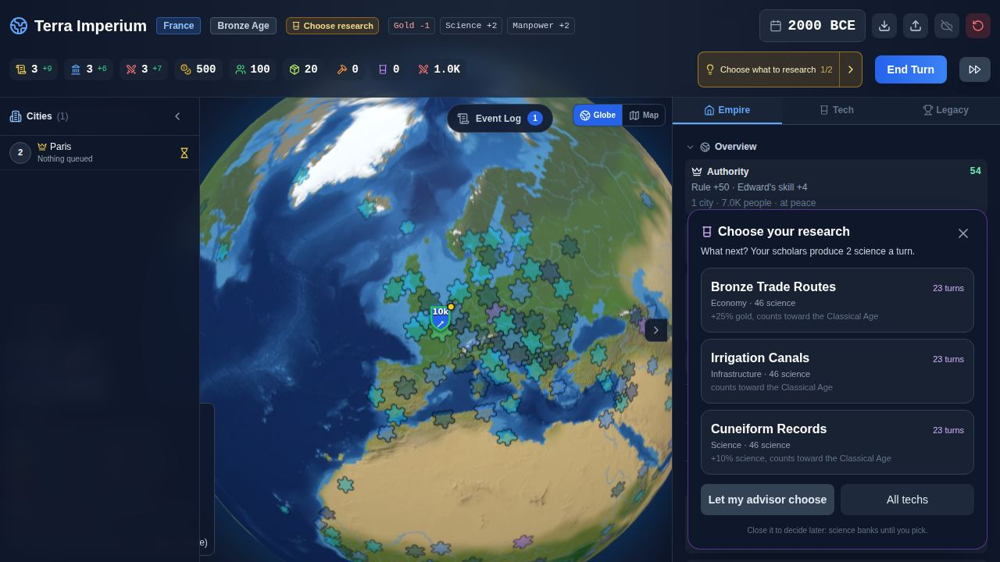
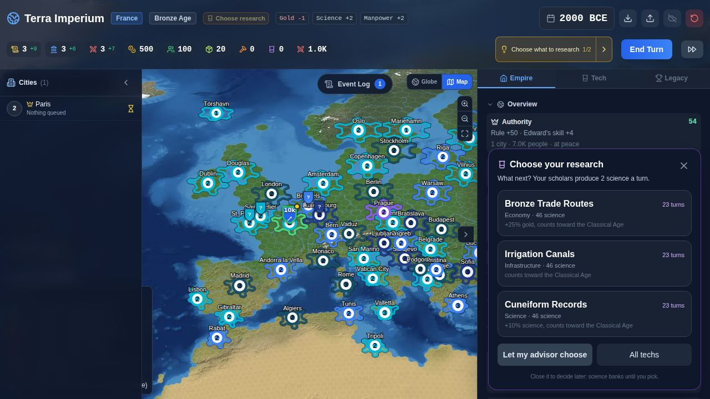
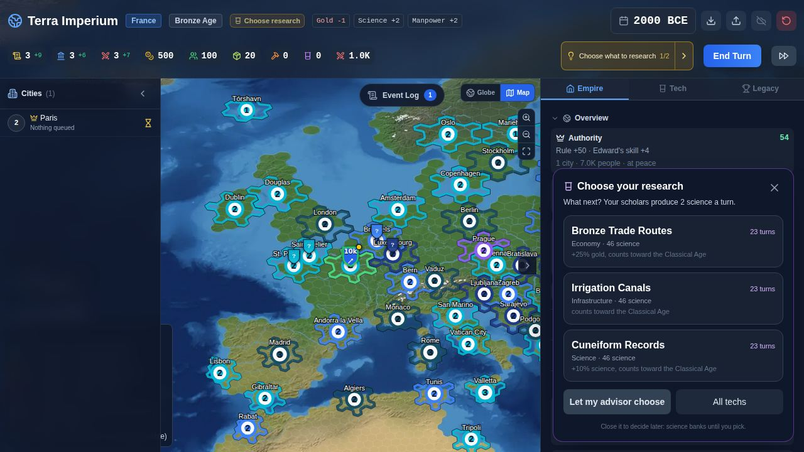
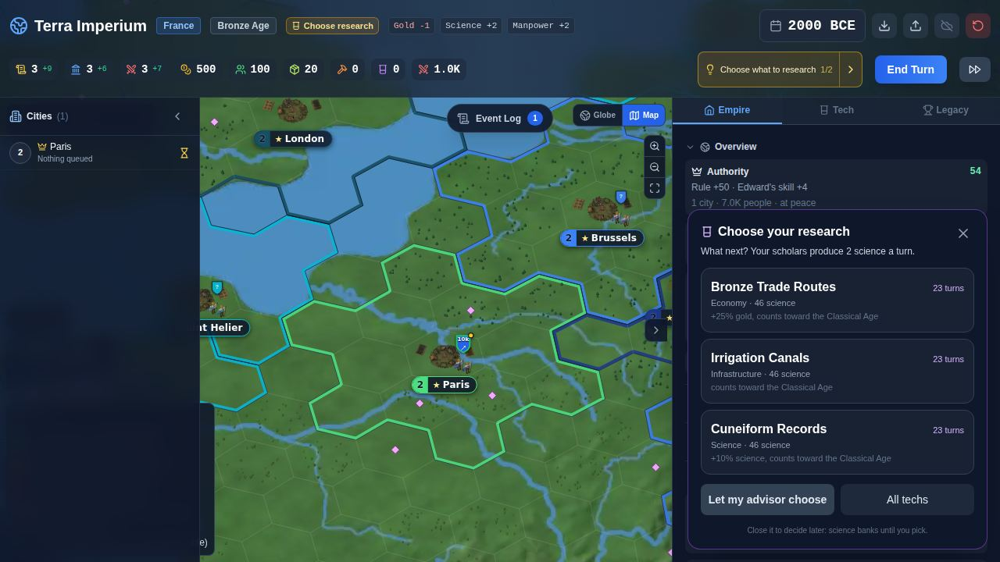
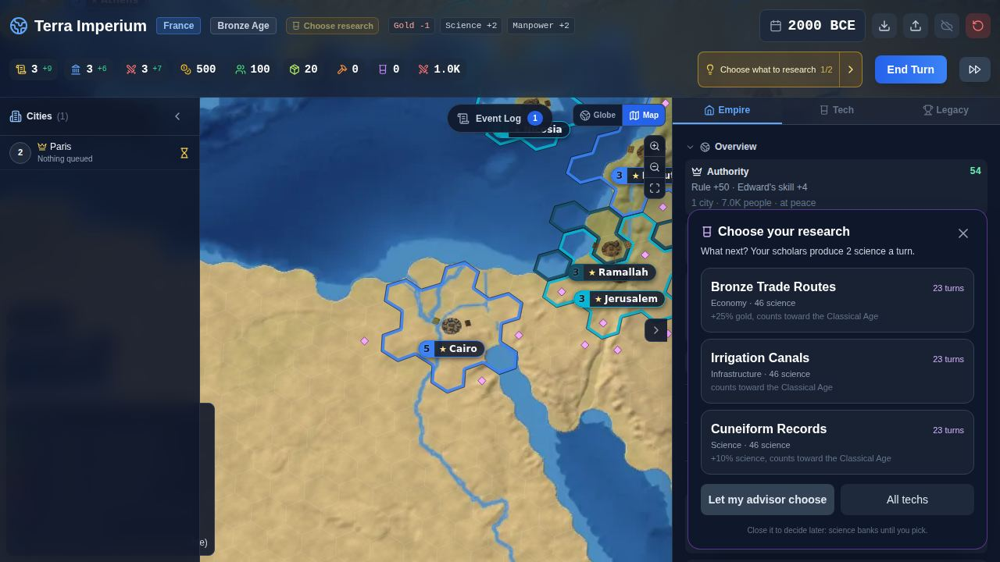
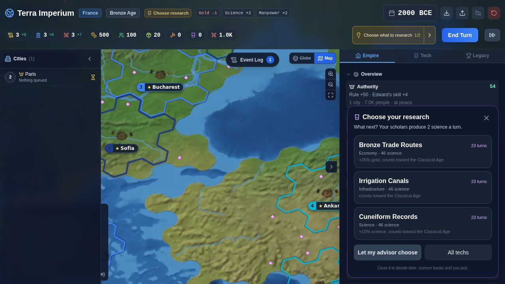

# grid-f100: the world on a frequency-100 hex grid

Branch `grid/f100`, base `4c06338` (claude/bronze-towns after the math wave). The user wants more
hexes: the grid goes from frequency 75 (56,252 cells, 102 km between neighbours) to frequency 100.
Every rule keeps its distance in km, so the game plays about the same on smaller hexes.

## The grid

| | frequency 75 | frequency 100 |
|---|---|---|
| cells | 56,252 | 100,002 |
| land cells | 16,494 | 29,250 |
| mean / min / max neighbour spacing | 102.2 / 76.5 / 112.5 km | 76.7 / 57.2 / 84.4 km |
| tile area | 9,067 km² | 5,100 km² |
| tiles.json | 4.6 MB | 8.0 MB |

- `scripts/geo/build-tiles.mjs`: `FREQUENCY = 100` (the one constant). The straits lines and the
  inlet pass are lat/lon and km, so they ran unchanged. At frequency 100 Gibraltar opens 1 cell, the
  Dardanelles 2, the Bosphorus 1; Kerch, the Gulf of Finland, Malacca and the Danish straits are
  open by themselves. 29 Arctic and estuary inlets opened. Closed pockets: only the Caspian (94
  cells) and the South Pole cell, as before.
- One build change: a town whose nearest cell is sea now puts its name on the nearest land cell
  among its 7 nearest (the straits report's open question). Names on water: 722 before, 53 now
  (small islands with no land that close). Istanbul, Mumbai, Singapore, Doha and Çanakkale are on
  land. Only `names` changed in tiles.json.
- The terrain mix per land tile is the same on both grids (grassland 27.4/27.3%, desert 18.2/18.2%,
  hills 27.0/27.0%, forest 19.9/20.1%, resources 36.8/37.0%). Two shares fall, as geometry says
  they must (a line feature touches about f cells, land holds about f² cells): tiles with a river
  edge 47.1% to 38.4%, coastal land tiles 17.5% to 14.2%. Per km² both are unchanged.
- Rebuilt in order: `build:tiles`, `build-hex-coast.mjs` (716 landmasses), `build:raster`,
  `build:pyramid` (the pyramid needs `fetch-tiles-raw.mjs --pyramid` first).

## Rules in km

Every remaining ring count is now a km literal converted by `ringsForKm` (gridScale.js). The km
value is the old ring count x 102 km, so frequency 75 gives the old numbers exactly.

| rule | km | rings at f75 | rings at f100 |
|---|---|---|---|
| city spacing (MIN_CITY_SPACING), start spacing | 306 | 3 | 4 |
| border reach by age / max | 204 / 306 | 2 / 3 | 3 / 4 |
| settler moves | 306 | 3 | 4 |
| settler reach / AI settle search | 1,734 / 1,122 | 17 / 11 | 23 / 15 |
| AI march steps / AI raid reach | 4,080 / 1,122 | 40 / 11 | 53 / 15 |
| supply line / road bonus | 816 / 204 | 8 / 2 | 11 / 3 |
| governor group | 816 | 8 | 11 |
| claim range | 714 | 7 | 9 |
| air range / patrol | 1,122 / 612 | 11 / 6 | 15 / 8 |
| threat, settled-near opinion | 612 | 6 | 8 |
| raider reach, city name search | 306 | 3 | 4 |
| retreat | 102 | 1 | 1 |
| sight land, army, fleet / hills bonus | 200 / 100 | 2 / 1 | 3 / 1 |
| scenario claims (Dawn to Gunpowder) | 102, 204, 306, 408 | 1 to 4 | 1, 3, 4, 5 |
| extra-city search around a capital | 1,224 | 12 | 16 |

Bonuses are km too, added before the conversion, so a sum rounds once:
- `src/data/techMapEffects.js`: sight, navalMoves, borderRing, claimRange, governorRings,
  lineRings and movePoints are km (102 per old tile).
- Naval lines' extra sight (navalLines.js) is km. Forced March adds `FORCED_MARCH_KM` (102).
- `national.supplyRange` (a modifier total in tiles) converts with `ringsFromF75`.

Rounding: a rule of 204 km is 2.66 rings at f100 and rounds to 3 (230 km). Borders, sight and siege
moves therefore reach about 13% further than at f75; the 306 km rules land on 3.99 rings and are
exact.

Other conversions:
- Opinion: a shared border counts length (tiles x spacing / 102 km), so the same km of border rubs
  the same.
- Settler site scoring: the distance penalty is 0.6 per 102 km of walk.
- Culture tile costs are per area: a tile costs its share of 9,067 km² (0.56 at f100). The ring
  term counts km and the owned-tiles term counts owned area. A city buys the same km² for the same
  culture on any grid.

## Founding: same land, more tiles

Decision: a new city claims a fixed area, not a fixed tile count. `foundingDisk` (gridScale.js)
takes whole shells (ring 1, then the six ring-2 tiles that touch two ring-1 tiles, then the rest
of ring 2) until the area is closest to the f75 ring 1 (7 x 9,067 = 63,470 km²). That is ring 1
at f75 (7 tiles) and ring 1 plus the near ring-2 tiles at f100 (13 tiles, 66,300 km²). The Dawn
scenario claims the same disk.

Why not ring 1 (7 tiles, 36,000 km²):
- Start territories would shrink by 44% in km². The first test run showed it: Dawn land claimed
  fell from about 10% to 3.3%, and Madagascar's capital lost its coast (no port, no sea lane).
- Culture costs are already per area, so a km² founding keeps the whole territory model in one
  unit.
- Food and production per city stay about the same either way: a city works as many tiles as its
  size, and yields are per tile. A 13-tile disk only gives a slightly better choice.

Measured (8 seeds, turn 150): tiles per city 9.7 at f75, 17.4 at f100 (x1.79, the area ratio);
mean city size 3.55 vs 3.81 (+7%, the better choice of tiles).

## Movement

Armies move km a turn: `MOVE_KM` in armies.js (infantry, ranged, support and settlers 306, cavalry
and air 613, siege 204). That is 3/3/6/2 points at f75 and 4/4/8/3 at f100. Fleets: `NAVAL_KM_BY_AGE`
409 to 1,124 km, 4 to 11 tiles at f75 and 5 to 15 at f100. Tile costs stay per tile (hills 2,
mountains 4, roads 0.5), so rough ground costs the same share of a turn per km. `BANK_CAP` stays 4
points so a mountain can still be crossed. Mechanized Warfare adds 204 km (+3 points at f100).

## The close view

`hexSizeVsF75()` (75 / frequency, 0.75 now) scales the flat map's zoom thresholds and model sizes:
`CLOSE_ZOOM_K` 10 to 13.3, the hex overlay from k 4, resource glyphs from k 6.7, trees from k 18.7,
`unitPx` x 0.75 and the tree spread radius x 0.75. At its first zoom the close view looks as it
did; a town stays inside its hex. Trees per hex and town room (in hex spacings) are unchanged,
since they are per hex already. The tactical battlefield is built from the tile and its six
neighbours and has no km in it, so nothing changed there.

## Save version 10

`CURRENT_SAVE_VERSION = 10`, `OLDEST_LOADABLE_SAVE_VERSION = 10`. Versions 7 to 9 get a new reason
`oldGrid`: "This save is from the earlier map with fewer, larger hexes. The map now has about
100,000 smaller hexes and every tile changed, so the save cannot be converted." The old save stays
on the device (OldSaveNotice). The version 8 to 9 land-change step and its tile list are gone;
`world/landChanges.js` stays for a future rebuild that keeps tile ids, and its test now builds its
own change list on the shipped grid.

## Tests

Every test that assumed frequency-75 counts now reads the grid: `tiles.count === cellCount(tiles.
frequency)`, `ringsForKm(SIGHT_LAND_KM)`, `ringsForKm(MOVE_KM.infantry + 204)`, `startSpacing(tiles)`
and so on. The gridScale "other grid" test now builds frequency 50 (coarser than the shipped grid).
Fixtures that picked the first tile or city matching a filter were tightened to what they test: a
hill forest on grassland or plains, a mountain step with no river crossing, a coastal city whose
sea lies to the east (see open question 4), any moved capital rather than Jerusalem.

Results: `npx vitest run` 2,427 passed, 0 failed. `npm run lint` clean. Playwright e2e 7 of 7.

## Performance

Back to back on this machine, seed 11 and 12, 110 measured turns after 10, PLAYER=au:

| | base 4c06338 | f100, first build | f100, final |
|---|---|---|---|
| seed 11 mean / worst | 163.4 / 266 ms | 206.2 / 378 ms | 194.9 / 336 ms |
| seed 12 mean / worst | 166.9 / 263 ms | | 206.4 / 420 ms (before the spacing index) |
| owned tiles at turn 120 | 6,614 | 12,453 | 12,453 |

About +17 to 23%, inside the 30% budget (perf.md estimated 163 to 170 ms from its 136 ms head;
this base measured 163 to 176 ms here). Two exact fixes (same world, number for number):

1. **The ownership map copy.** `world.tileOwner` is copied once a turn on the first claim. Keyed by
   tile ids up to 100,000, a map built in a scattered order sits in V8's dictionary mode, where a
   spread costs about 1.5 µs a key (11 to 20 ms a turn here). V8 only switches it back to fast
   elements when 2 x 3 x its hash capacity >= the highest id, so on a bigger grid it stays slow
   longer. `copyMap` (world/cities.js) rebuilds a map it did not make in ascending key order, which
   gives fast elements and a 0.6 ms block copy. Turn 206 to 191 ms. Not complete: a spread copy has
   no headroom, so a claim above its highest id can send it back to dictionary mode later. Typed
   ownership storage (perf.md) is the full fix.
2. **The city spacing index** (tiles within MIN_CITY_SPACING - 1 rings of a city) was a Map of
   about 30,000 entries, copied whenever cities were added. Now it is an Int32Array of blocking
   centres plus a centre-to-name map, filled from the memoised rings. Cities phase 70.8 to 61.3 ms.

What still scales with cells (cities phase about 61 ms vs 53): the AI settler site search
(`bestSites`, 15 rings: about 700 cells per search vs 400), claim candidates over 17-tile cities,
the registry (+3 ms) and research boosts (+1.4 ms). All of it is linear in claimed tiles.

## Balance

`PLAYER=au .claude/skills/balance-sim/compare.sh 4c06338 150 11-18` (paired, 95% intervals):

| metric | base | f100 | diff | 95% CI |
|---|---|---|---|---|
| warsTotal | 5.38 | 6.13 | +0.75 | [-2.27, 3.77] |
| conquests | 0.63 | 0.50 | -0.13 | [-1.26, 1.01] |
| civilWarsStarted | 23.5 | 23.8 | +0.25 | [-7.27, 7.77] |
| rebelStacks | 37.9 | 42.5 | +4.63 | [-15.4, 24.7] |
| loyaltyFlips | 5.25 | 4.00 | -1.25 | [-3.96, 1.46] |
| citiesChangedHands | 5.75 | 5.38 | -0.38 | [-4.37, 3.62] |
| topNationProvinces | 15.0 | 15.6 | +0.63 | [-0.55, 1.80] |
| avgUnrest | 5.80 | 6.47 | +0.68 | [-1.37, 2.72] |
| medianAiTechs | 5.00 | 5.25 | +0.25 | [-0.14, 0.64] |
| nationsAlive | 240.0 | 239.9 | -0.13 | [-0.42, 0.17] |
| **cities** | 856.4 | 896.1 | +39.8 | [32.7, 46.8] |
| **landClaimedPct** | 41.1 | 44.3 | +3.21 | [2.81, 3.62] |
| **effectiveNations** | 124.7 | 126.2 | +1.56 | [0.30, 2.82] |
| **playerGold** | 2551 | 1817 | -734 | [-743, -726] |
| **playerSupplies** | 165 | 289 | +124 | [123, 125] |
| **playerTechs** | 10.3 | 9.13 | -1.13 | [-1.66, -0.59] |

Plague (not in the harness; a paired probe over the same 8 seeds, 150 turns): infected city-turns
base 499, 149, 50, 68, 67, 18, 19, 960 (mean 229); f100 223, 10, 0, 122, 9, 585, 385, 39 (mean
172). Outbreaks: mean 22.9 vs 18.5. Heavy-tailed on both sides, with f100 higher on 3 of 8 seeds:
in range.

Reading:
- Wars, conquests, civil wars, rebels, flips, the top nation and AI tech are all within noise.
- **Cities +4.6% and land claimed +3.2 points.** Borders reach 230 km (rounded up from 204), and
  the denser grid has more sites that pass the quality floor in the same land. Small, and it
  leaves the world slightly less concentrated (effective nations +1.6).
- **The player (Australia, passive).** Canberra grows slower: size 2 at turn 50 (3 in base), 4 at
  turn 150 (5). That is local: its f100 centre cell and disk have less food than the f75 cell
  had, and world-wide cities grow 7% bigger. A smaller city means less gold and science; its tiles
  lean to production, so more supplies. Other players will see the same kind of local change
  either way.
- **Ports:** cities whose centre touches the sea fall from 36.4% to 32.0% at turn 150 (see open
  questions).

## Screenshots

| | |
|---|---|
| Globe, Dawn start |  |
| Flat map, Europe, k 4: 13-tile start disks |  |
| Close view begins, k 14 |  |
| Close view, Paris, k 24: town inside its hex, trees |  |
| The Nile, k 16 |  |
| Marmara and the Black Sea, k 18 |  |
| Phone 844x390, close view k 24 |  |

Browser check (vite dev, Chromium): globe, flat map at k 1, 4, 8, close view at k 14 to 24, the
Nile, Gibraltar, the Bosphorus, Øresund, Greece, at 1280x720 and 844x390. No console errors except
Vite's one-off "Outdated Optimize Dep" on a cold dev server.

## Open questions

1. **Ports and fresh water are per hex.** A city is a port when its centre hex touches the sea
   (within about 51 km of the coast at f75, 38 km at f100) and has fresh water (+1 housing) when its
   centre hex has a river edge. Both shares fell (ports 36% to 32%). A km rule ("within 50 km of the
   coast or a river") needs a distance to the coastline per tile, which the build could store.
   Worth deciding before more hexes.
2. **The early-fleet band.** The coast terrain (water next to land) is one hex wide: about 77 km
   now instead of 102. Bronze Age fleets keep closer to the shore.
3. **Rounding of the 204 km rules** to 3 rings (230 km): borders, sight and siege moves reach about
   13% further. Writing them as 180 km would round to 2 at f75 and 2 at f100 (154 km); I left the
   km as they were so f75 stays exact.
4. **The battlefield's north and south sectors** never reach the water band (d >= 0.77 is outside a
   96x64 field), and the west is the attacker's deployment ground, so a coast to the north, south or
   west of a city shows as a beach or not at all. Pre-existing, for battle-lab.
5. **Perf follow-ups:** typed `tileOwner` storage (the copy can still fall back to dictionary mode
   late in a game); a nation-independent table of valid settler sites per map, or an upper bound on
   site quality so `bestSites` stops early.
6. **tiles.json is 8 MB** (was 4.6). It loads once; a binary or gzip-friendly layout would help the
   first load on phones.
