# Straits: every real sea reaches the ocean

Session `straits` of the math wave (plans/math/BRIEF.md). Branch `math/straits`.

## The problem
The frequency-75 grid has hexes about 102 km apart, while Gibraltar is 14 km wide, the Kerch strait
4 km and the Bosphorus 1 km. A strait cell is mostly land, so the land polygon test makes it land.
On the shipped grid (before this change) a flood fill from the mid-Atlantic found 26 separate
bodies of sea water:

| Closed body | Cells | Why |
|---|---|---|
| Mediterranean + Black Sea | 317 | Gibraltar was land (the old point list already patched the Dardanelles and Marmara) |
| Sea of Azov | 3 | Kerch strait was land |
| Neva Bay (Gulf of Finland, east end) | 2 | the gulf is narrower than a hex |
| Gulf of California, north end | 5 | the midriff islands |
| St Lawrence estuary | 2 + 1 | the estuary is narrower than a hex |
| Strait of Georgia | 1 | Juan de Fuca was land |
| Lake Maracaibo | 1 | the outlet to the Gulf of Venezuela was land |
| Gulf of Khambhat | 1 | the gulf mouth was land |
| Gulf of Ob, Taz estuary, Gydan Bay | 5 x 1 | the gulfs are narrower than a hex |
| Penzhina Bay, Prince Albert Sound, Scoresby Sund, George VI Sound, 4 Canadian Arctic inlets, Kandalaksha Gulf | 1 each | fjords and sounds |
| Caspian Sea | 50 | really landlocked: stays closed |
| South Pole cell | 1 | not a sea: the polygon test misses the pole itself (see open questions) |

## What changed
All in the build, so it survives the next rebuild at frequency 100 or more.

`scripts/geo/build-tiles.mjs`
- `STRAIT_LINES`: 21 straits as `[lat, lon]` polylines along the real channel, from open water to
  open water. The build samples each line every 0.05 degrees (about 5 km, finer than any planned
  grid) and turns every land cell it crosses into water. Nearest-cell regions along a line are
  contiguous, so the carved cells always form one connected channel at any frequency.
- A line carves only when its two ends are not already joined by a short local sea path
  (`straitDetour(cells) = 2 x cells + 2` steps). Where the grid keeps a strait open by itself (the
  Danish straits, Hormuz, Bab-el-Mandeb, the Bosphorus at frequency 75) no land is lost. Local
  matters: the Strait of Malacca's ends are also joined by sailing round Sumatra, and a global test
  closed it by mistake during this work (caught on the crop, now covered by a test).
- An inlet pass: a sea pocket that is not a real landlocked sea (`LANDLOCKED_SEAS`: the Caspian, and
  the South Pole cell) and lies within `MAX_INLET_GAP_KM = 230` km of land of the open ocean gets
  the shortest land path opened. The limit is in kilometres and converted with the grid's measured
  spacing (2 cells at frequency 75 and at frequency 100), so it never reaches the Caspian.
- The build logs every strait (opened cells or "already open"), every inlet and the closed pockets.
- A place whose cell a strait took keeps its name on the nearest land cell (Gibraltar, Helsinki,
  St Petersburg, Çanakkale, Maracaibo, Malacca, Surat).
- The old seven one-point patches are gone. Five of their cells were only needed as patches and are
  land again (north shore of Marmara, Bab-el-Mandeb, the White Sea throat, two in Malacca); the
  straits they patched stay open through the cells the lines now choose.

Rebuilt in order: `build:tiles`, `build-hex-coast.mjs`, `build:raster`, `build:pyramid`
(`src/data/geo/tiles.json`, `hexLand.json`, `public/map/world-*.webp`, `public/map/tiles/`).
The unchanged build reproduces the old tiles.json byte for byte, so the whole diff is this change.

### The numbers
- Tile ids: unchanged (they are grid ids; land flags do not move them). Cell count 56,252.
- Land cells: 16,523 -> 16,494. 34 cells became water, 5 became land, 39 in all.
- Sea: one ocean of 39,747 cells; only the Caspian (50) and the South Pole cell (1) are apart.
- Capitals: 240 of 240 on land. Two moved to a neighbouring land cell, names kept:
  Finland (Helsinki, the Gulf of Finland took its cell, now one ring north) and Gibraltar (its cell
  is the strait, now one ring north on the Spanish side, still owned by Gibraltar).
- Scenario starts: every city of every scenario on land (tested).

## Save migration
Save version 8 -> 9. `src/engine/world/landChanges.js` (`applyLandChanges`) repairs a loaded state
for a list of tiles whose land flag changed; `V9_LAND_CHANGES` in saveMigrations.js is the exact
list for this rebuild.
- A city centred on a tile that is now water moves its centre to the nearest land tile it owns (or
  a free land neighbour it claims). Same id, same name.
- Improvements, roads and districts on a tile that is now water are cleared (tileState).
- Ownership: the 34 new water tiles are all `coast`, which cities may own and work in this game, so
  ownership stays (clearing it would punch holes in borders). Ownership is cleared only on a new
  water tile no city can work (open ocean), which this rebuild does not produce.
- Units: `normalizeUnitTiles` sends a land unit on new water, or a fleet on new land, to its city.
- Unaffected saves come back as the same object.

Note for the lead: this bumps `CURRENT_SAVE_VERSION` to 9. If another branch also bumps it, the
steps need renumbering when merging.

## Tests
- `src/data/geo/seaConnectivity.test.js`: a flood fill from the mid-Atlantic reaches 38 real seas
  (Mediterranean basins, Marmara, Black Sea, Azov, Baltic and its gulfs, White Sea, Red Sea, Aqaba,
  Aden, Persian Gulf, Oman, Malacca, the East Asian seas, Hudson Bay, St Lawrence, California,
  Mexico, Caribbean, Arctic seas...); the only other water body is the Caspian (and the pole
  cell); every capital and every scenario city is on land; strait towns keep their names on land.
- `scripts/geo/straits.test.mjs`: each line in STRAIT_LINES is open through a short local channel.
- `src/engine/world/landChanges.test.js`: a version 8 save with Helsinki on its old tile, a road
  there, a fleet on a tile that is land now and an army on a tile that is water now loads clean
  (state audit) with the city on land and its name kept.
- No test assumes a cell count or ring count; probes are lat/lon points in the middle of each sea.

## How it scales to more hexes
Build time only: nothing runs per turn, so no cost at 56k or 100k cells. The lines are in lat/lon,
so they carve the right cells at any frequency, and fewer as hexes shrink (at frequency 100 the
Danish straits and the Bosphorus need nothing; Gibraltar and Kerch probably one cell each). The
inlet gap is in kilometres. The build step is O(cells) per strait for the local check, a few
seconds in all. The migration is O(cities + units) and runs once per old save; the next grid
change (a new frequency) changes every tile id and is a clean break anyway.

## Before and after
Each image: the hex grid before (left) and after (right) on top, the realistic Earth raster below.
Land green, sea blue; orange outline = a cell turned to water, red outline = a cell turned to land;
red dots = capitals; yellow = the strait line. Lines marked "already open" carve nothing.

| Strait | Result | Crop |
|---|---|---|
| Gibraltar | opened (1 cell) | 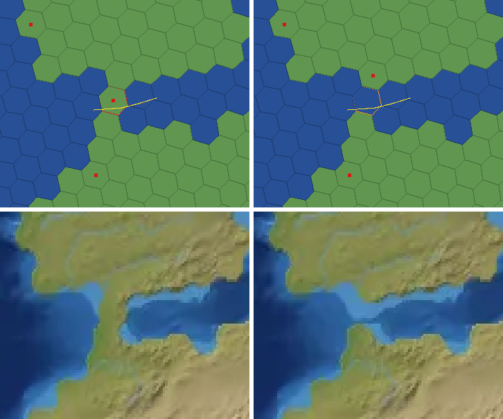 |
| Dardanelles | already open (patched in v8, kept) | 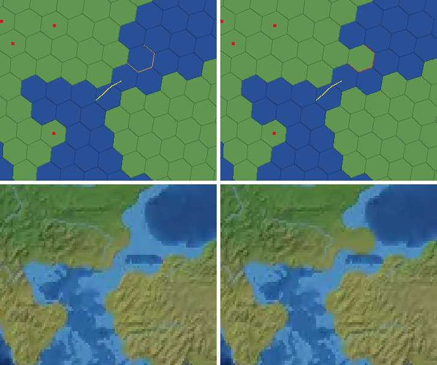 |
| Sea of Marmara | already open | 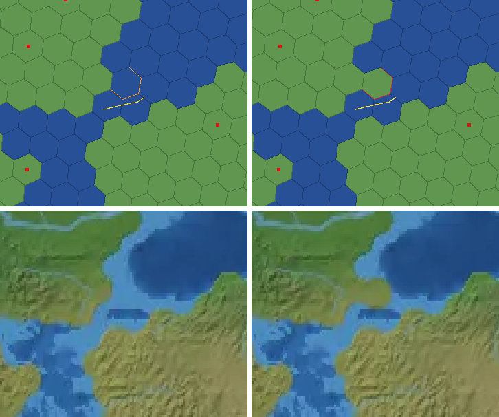 |
| Bosphorus | already open (the old Marmara patch cell is land again) | 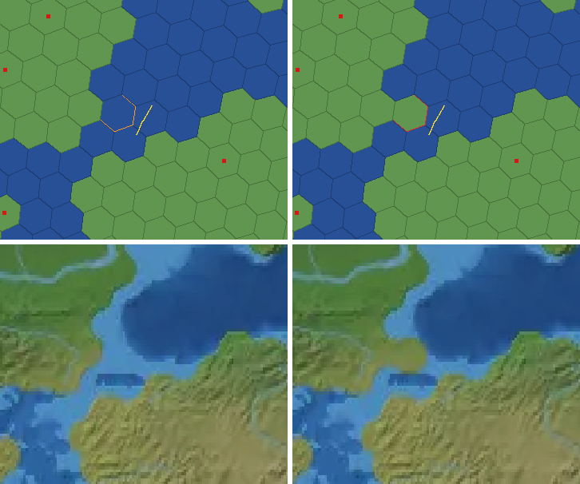 |
| Kerch | opened (1 cell, Kerch) | 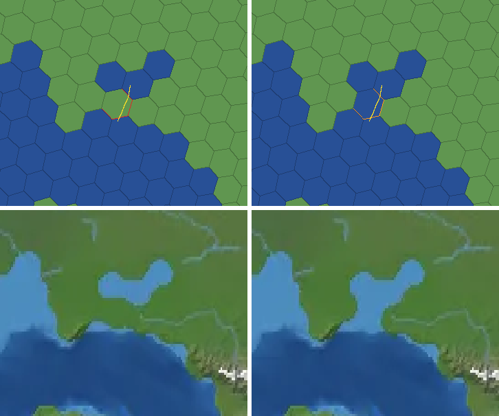 |
| Øresund | already open | 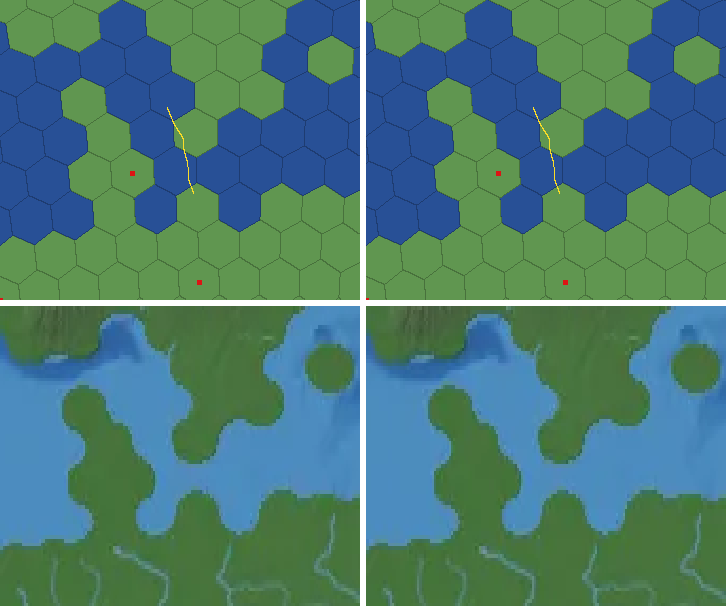 |
| Great Belt | already open | 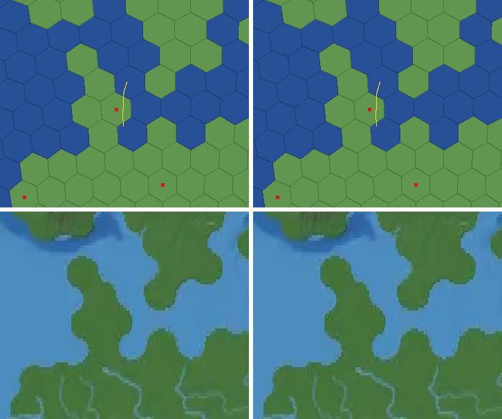 |
| Gulf of Finland | opened (2 cells, Helsinki and St Petersburg) | 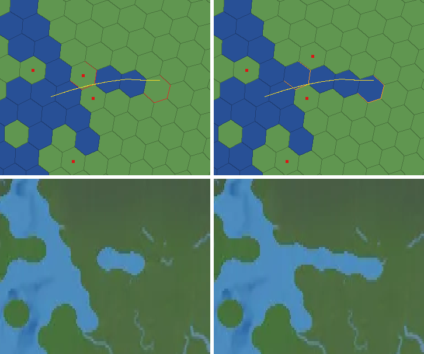 |
| White Sea throat | already open (old patch cell back to land) | 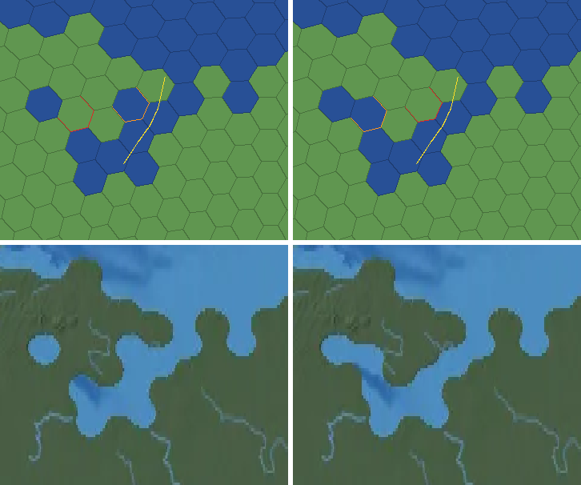 |
| Bab-el-Mandeb | already open (old patch cell back to land) | 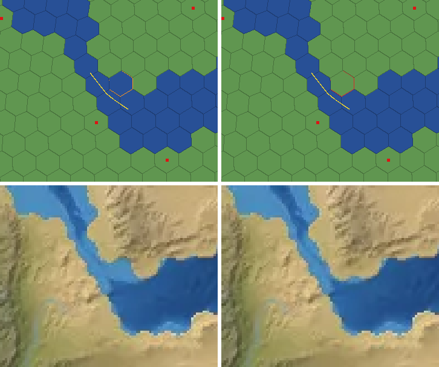 |
| Hormuz | already open | 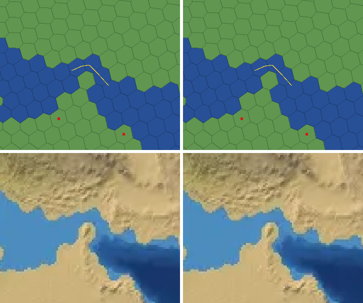 |
| Malacca | opened (2 cells; two old patch cells back to land) | 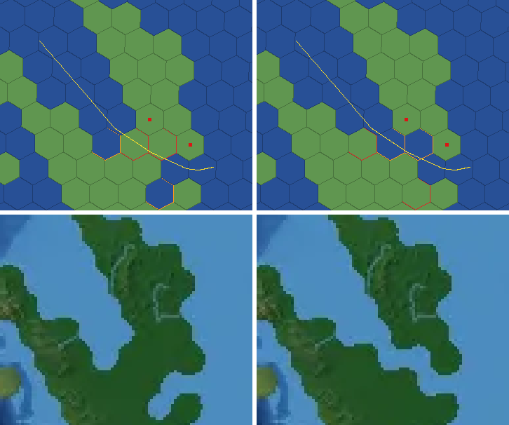 |
| Bass | already open | 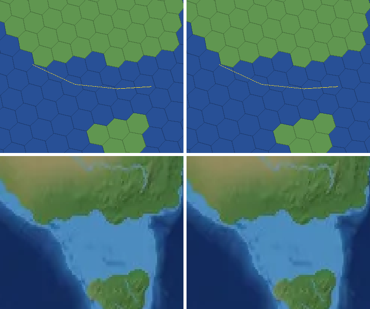 |
| Gulf of California midriff | opened (2 cells) | 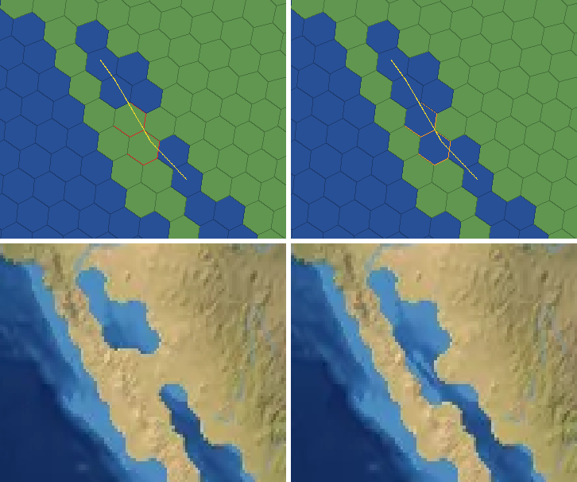 |
| St Lawrence estuary | opened (3 cells) | 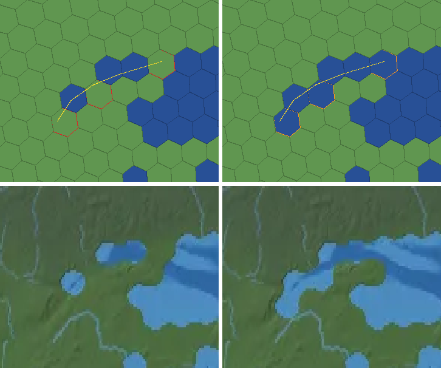 |
| Juan de Fuca and Georgia | opened (2 cells, Victoria and Nanaimo) | 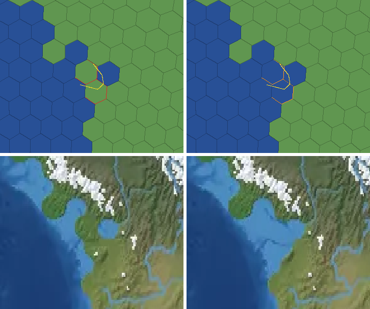 |
| Lake Maracaibo outlet | opened (2 cells) | 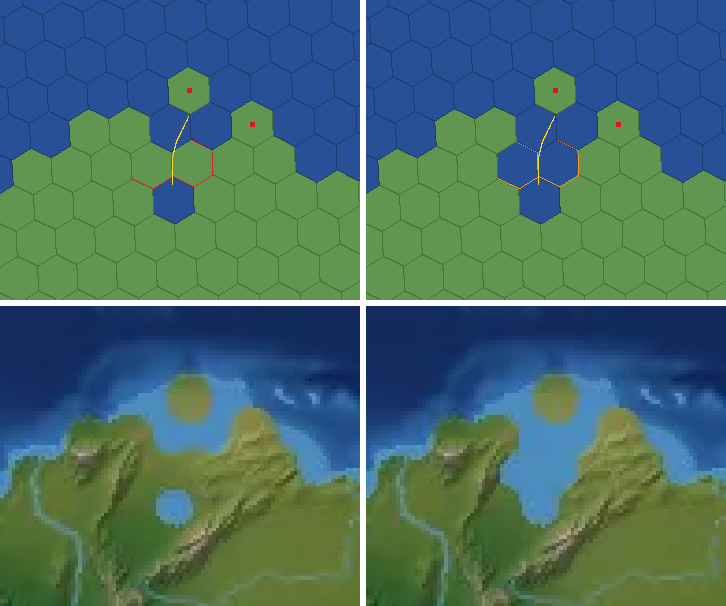 |
| Gulf of Khambhat | opened (2 cells) | 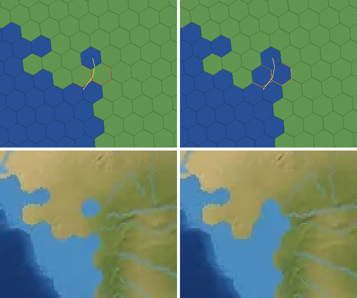 |
| Gulf of Ob | opened (5 cells) | 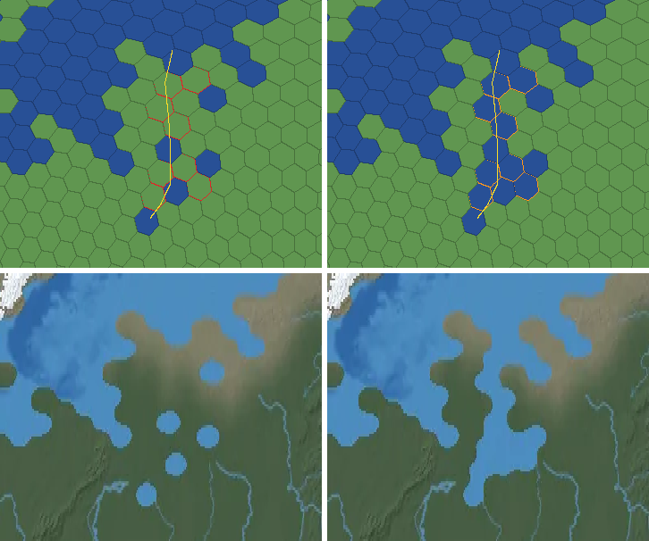 |
| Taz estuary | opened (2 cells) | 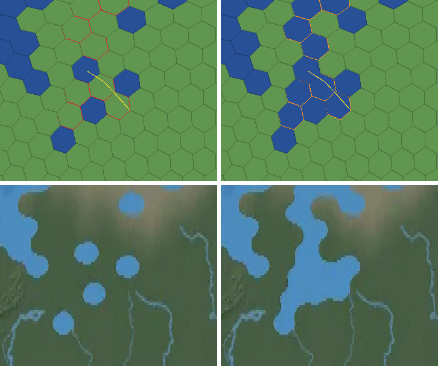 |
| Gydan Bay | opened (1 cell) | 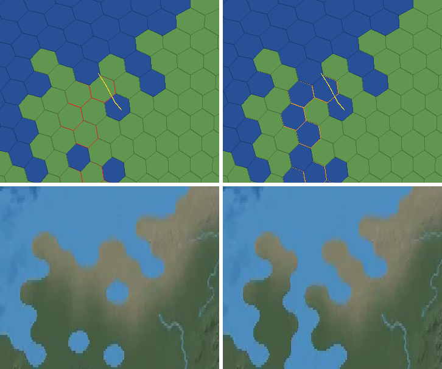 |

Regenerate the crops with
`node scripts/geo/straits-crops.mjs <old tiles.json> src/data/geo/tiles.json plans/math/straits <old world-4096.webp> public/map/world-4096.webp`.

## Open questions
- 672 place names sit on water cells because their nearest cell centre is in the sea (Istanbul,
  Mumbai, Singapore, Doha among them). Scenario extra cities only use named land tiles, so these
  can never be a start city. Moving every such name to its nearest land cell is a one-line build
  change, but it shifts extra-city sites for every scenario, so it is left for the lead to decide.
- The Gulf of Suez is narrower than a hex and does not exist on the grid. It is a gulf, not a
  strait, so it is not carved; add a line if the Sinai should be cut off by water to the west.
- The South Pole cell reads as water (a polygon test at exactly -90 misses). Making it land puts
  a pole inside Antarctica's territory polygon in the kingdoms start, which tileGeometry.js does not
  handle, so it stays as it is and is listed as an exception.
- Messina is left out: Sicily is always reachable by sea round the island, so the "already open"
  rule would never carve it, and carving it at 100 km hexes would delete Reggio or Messina.
